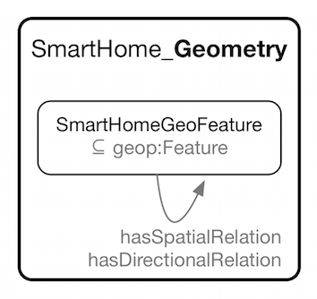

 __This pattern has been certified.__
Related submission, with evaluation history, can be found __here__

#  Graphical representation

__Diagram__

#  General description

  

#  Elements

_The __SmartHome Geometry__ Content OP locally defines the following ontology elements:_

 __eastOf__ (owl:ObjectProperty) 
  _[eastOf](../Submissions/SmartHome_Geometry/eastOf "Submissions:SmartHome Geometry/eastOf") page_
 __hasDirectionalRelation__ (owl:ObjectProperty) 
  _[hasDirectionalRelation](../Submissions/SmartHome_Geometry/hasDirectionalRelation "Submissions:SmartHome Geometry/hasDirectionalRelation") page_
 __hasSpatialRelation__ (owl:ObjectProperty) 
  _[hasSpatialRelation](../Submissions/SmartHome_Geometry/hasSpatialRelation "Submissions:SmartHome Geometry/hasSpatialRelation") page_
 __northEastOf__ (owl:ObjectProperty) 
  _[northEastOf](../Submissions/SmartHome_Geometry/northEastOf "Submissions:SmartHome Geometry/northEastOf") page_
 __northOf__ (owl:ObjectProperty) 
  _[northOf](../Submissions/SmartHome_Geometry/northOf "Submissions:SmartHome Geometry/northOf") page_
 __northWestOf__ (owl:ObjectProperty) 
  _[northWestOf](../Submissions/SmartHome_Geometry/northWestOf "Submissions:SmartHome Geometry/northWestOf") page_
 __southEastOf__ (owl:ObjectProperty) 
  _[southEastOf](../Submissions/SmartHome_Geometry/southEastOf "Submissions:SmartHome Geometry/southEastOf") page_
 __southOf__ (owl:ObjectProperty) 
  _[southOf](../Submissions/SmartHome_Geometry/southOf "Submissions:SmartHome Geometry/southOf") page_
 __southWestOf__ (owl:ObjectProperty) 
  _[southWestOf](../Submissions/SmartHome_Geometry/southWestOf "Submissions:SmartHome Geometry/southWestOf") page_
 __westOf__ (owl:ObjectProperty) 
  _[westOf](../Submissions/SmartHome_Geometry/westOf "Submissions:SmartHome Geometry/westOf") page_
 __SmartHomeGeoFeature__ (owl:Class) 
  _[SmartHomeGeoFeature](../Submissions/SmartHome_Geometry/SmartHomeGeoFeature "Submissions:SmartHome Geometry/SmartHomeGeoFeature") page_
#  Additional information

#  Scenarios

__Scenarios about SmartHome Geometry__
No scenario is added to this Content OP.

#  Reviews

__Reviews about SmartHome Geometry__
There is no review about this proposal.
This revision (revision ID __13129__) takes in account the reviews: none

Other info at [evaluation tab](http://ontologydesignpatterns.org/wiki/index.php?title=Submissions:SmartHome_Geometry&action=evaluation "http://ontologydesignpatterns.org/wiki/index.php?title=Submissions:SmartHome_Geometry&action=evaluation")

  

#  Modeling issues

__Modeling issues about SmartHome Geometry__
There is no Modeling issue related to this proposal.

  

#  References

[Add a reference](index.php@title=Odp%253AAdd_reference&subject=Submissions%253ASmartHome+Geometry.html "http://ontologydesignpatterns.org/wiki/index.php?title=Odp:Add_reference&subject=Submissions%3ASmartHome+Geometry")

  

Retrieved from "[http://ontologydesignpatterns.org/wiki/Submissions:SmartHome\_Geometry](../Submissions/SmartHome_Geometry)"
 [Category](http://ontologydesignpatterns.org/wiki/Special:Categories "Special:Categories"): [ProposedContentOP](../Category/ProposedContentOP "Category:ProposedContentOP")