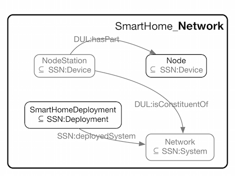

 __This pattern has been certified.__
Related submission, with evaluation history, can be found __here__

#  Graphical representation

__Diagram__

#  General description

  

#  Elements

_The __SmartHome Network__ Content OP locally defines the following ontology elements:_

 __receivesDataFrom__ (owl:ObjectProperty) 
  _[receivesDataFrom](../Submissions/SmartHome_Network/receivesDataFrom "Submissions:SmartHome Network/receivesDataFrom") page_
 __sendsDataTo__ (owl:ObjectProperty) 
  _[sendsDataTo](../Submissions/SmartHome_Network/sendsDataTo "Submissions:SmartHome Network/sendsDataTo") page_
 __DataReceiverNode__ (owl:Class) 
  _[DataReceiverNode](../Submissions/SmartHome_Network/DataReceiverNode "Submissions:SmartHome Network/DataReceiverNode") page_
 __DataSenderNode__ (owl:Class) 
  _[DataSenderNode](../Submissions/SmartHome_Network/DataSenderNode "Submissions:SmartHome Network/DataSenderNode") page_
 __Network__ (owl:Class) A network which is a collection of Nodes 
  _[Network](../Submissions/SmartHome_Network/Network "Submissions:SmartHome Network/Network") page_
 __Node__ (owl:Class) 
  _[Node](../Submissions/SmartHome_Network/Node "Submissions:SmartHome Network/Node") page_
 __NodeStation__ (owl:Class) 
  _[NodeStation](../Submissions/SmartHome_Network/NodeStation "Submissions:SmartHome Network/NodeStation") page_
 __ReceiverNodeStation__ (owl:Class) 
  _[ReceiverNodeStation](../Submissions/SmartHome_Network/ReceiverNodeStation "Submissions:SmartHome Network/ReceiverNodeStation") page_
 __SenderNodeStation__ (owl:Class) 
  _[SenderNodeStation](../Submissions/SmartHome_Network/SenderNodeStation "Submissions:SmartHome Network/SenderNodeStation") page_
 __SmartHomeDeployment__ (owl:Class) 
  _[SmartHomeDeployment](../Submissions/SmartHome_Network/SmartHomeDeployment "Submissions:SmartHome Network/SmartHomeDeployment") page_
#  Additional information

#  Scenarios

__Scenarios about SmartHome Network__
No scenario is added to this Content OP.

#  Reviews

__Reviews about SmartHome Network__
There is no review about this proposal.
This revision (revision ID __13121__) takes in account the reviews: none

Other info at [evaluation tab](http://ontologydesignpatterns.org/wiki/index.php?title=Submissions:SmartHome_Network&action=evaluation "http://ontologydesignpatterns.org/wiki/index.php?title=Submissions:SmartHome_Network&action=evaluation")

  

#  Modeling issues

__Modeling issues about SmartHome Network__
There is no Modeling issue related to this proposal.

  

#  References

[Add a reference](index.php@title=Odp%253AAdd_reference&subject=Submissions%253ASmartHome+Network.html "http://ontologydesignpatterns.org/wiki/index.php?title=Odp:Add_reference&subject=Submissions%3ASmartHome+Network")

  

Retrieved from "[http://ontologydesignpatterns.org/wiki/Submissions:SmartHome\_Network](../Submissions/SmartHome_Network)"
 [Category](http://ontologydesignpatterns.org/wiki/Special:Categories "Special:Categories"): [ProposedContentOP](../Category/ProposedContentOP "Category:ProposedContentOP")