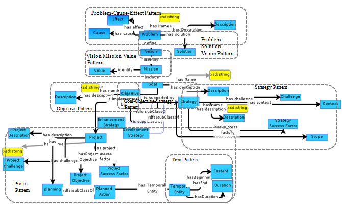

 __This pattern has been certified.__
Related submission, with evaluation history, can be found __here__

#  Graphical representation

__Diagram__

#  General description

  

#  Elements

_The __Smart City Strategy Design__ Content OP locally defines the following ontology elements:_

#  Additional information

#  Scenarios

__Scenarios about Smart City Strategy Design__
No scenario is added to this Content OP.

#  Reviews

__Reviews about Smart City Strategy Design__
There is no review about this proposal.
This revision (revision ID __13435__) takes in account the reviews: none

Other info at [evaluation tab](http://ontologydesignpatterns.org/wiki/index.php?title=Submissions:Smart_City_Strategy_Design&action=evaluation "http://ontologydesignpatterns.org/wiki/index.php?title=Submissions:Smart_City_Strategy_Design&action=evaluation")

  

#  Modeling issues

__Modeling issues about Smart City Strategy Design__
There is no Modeling issue related to this proposal.

  

#  References

[Add a reference](index.php@title=Odp%253AAdd_reference&subject=Submissions%253ASmart+City+Strategy+Design.html "http://ontologydesignpatterns.org/wiki/index.php?title=Odp:Add_reference&subject=Submissions%3ASmart+City+Strategy+Design")

* Taamallah, A., Khemaja, M., & Faiz, S. (2018, October). Toward a framework for smart city strategies design. In Proceedings of the 3rd international conference on smart city applications (pp. 1-7). Conference Paper | [reference page](../Community/References/Paper.md "Community:References/Paper")
* Taamallah, A., Khemaja, M., & Faiz, S. (2018, October). Towards a framework for participatory strategy design in smart cities. In The Proceedings of the Third International Conference on Smart City Applications (pp. 179-192). Springer, Cham. Documentation | [reference page](../Community/References/Paper_2.md "Community:References/Paper 2")
* Taamallah, A., Khemaja, M., & Faiz, S. (2019). A web-based platform for strategy design in smart cities. International Journal of Web Based Communities, 15(1), 62-84. Documentation | [reference page](../Community/References/Paper_4.md "Community:References/Paper 4")
* Taamallah, A., Khemaja, M., & Faiz, S. (2020). Building a Framework for Smart Cities: Strategy Development. In Smart Governance for Cities: Perspectives and Experiences (pp. 29-53). Springer, Cham. Documentation | [reference page](../Community/References/Paper_3.md "Community:References/Paper 3")

Retrieved from "[http://ontologydesignpatterns.org/wiki/Submissions:Smart\_City\_Strategy\_Design](../Submissions/Smart_City_Strategy_Design.md)"
 [Categories](http://ontologydesignpatterns.org/wiki/Special:Categories "Special:Categories"): [ProposedContentOP](../Category/ProposedContentOP.md "Category:ProposedContentOP") | [Waiting for review](../Category/Waiting_for_review.md "Category:Waiting for review")