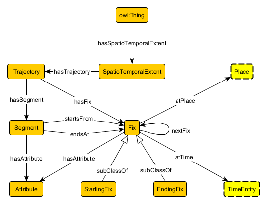

 __This pattern has been certified.__
Related submission, with evaluation history, can be found __here__

#  Graphical representation

__Diagram__

#  General description

  

#  Elements

_The __SpatioTemporalExtent__ Content OP locally defines the following ontology elements:_

 __hasSpatioTemporalExtent__ (owl:ObjectProperty) Property relating anything (thus the domain is trivially owl:Thing and the range is unscoped) to a SpatioTemporalExtent. 
  _[hasSpatioTemporalExtent](../Submissions/SpatioTemporalExtent/hasSpatioTemporalExtent.md "Submissions:SpatioTemporalExtent/hasSpatioTemporalExtent") page_
 __hasTrajectory__ (owl:ObjectProperty) Set to be equivalent to trj:hasTrajectory from the Trajectory pattern, this property relates anything (including SpatioTemporalExtent) to Trajectory. 
  _[hasTrajectory](../Submissions/SpatioTemporalExtent/hasTrajectory.md "Submissions:SpatioTemporalExtent/hasTrajectory") page_
 __SpatioTemporalExtent__ (owl:Class) The class that represents the notion of spatiotemporal extent. A spatiotemporal extent is realized as a collection of generalized trajectories that have no temporal overlap. 
  _[SpatioTemporalExtent](../Submissions/SpatioTemporalExtent/SpatioTemporalExtent.md "Submissions:SpatioTemporalExtent/SpatioTemporalExtent") page_
 __Trajectory__ (owl:Class) The hook to the Trajectory pattern, which acts as a component of the Spatiotemporal Extent pattern. 
  _[Trajectory](../Submissions/SpatioTemporalExtent/Trajectory.md "Submissions:SpatioTemporalExtent/Trajectory") page_
#  Additional information

#  Scenarios

__Scenarios about SpatioTemporalExtent__
No scenario is added to this Content OP.

#  Reviews

__Reviews about SpatioTemporalExtent__
There is no review about this proposal.
This revision (revision ID __12771__) takes in account the reviews: none

Other info at [evaluation tab](http://ontologydesignpatterns.org/wiki/index.php?title=Submissions:SpatioTemporalExtent&action=evaluation "http://ontologydesignpatterns.org/wiki/index.php?title=Submissions:SpatioTemporalExtent&action=evaluation")

  

#  Modeling issues

__Modeling issues about SpatioTemporalExtent__
There is no Modeling issue related to this proposal.

  

#  References

[Add a reference](index.php@title=Odp%253AAdd_reference&subject=../Submissions/SpatioTemporalExtent.md "http://ontologydesignpatterns.org/wiki/index.php?title=Odp:Add_reference&subject=Submissions%3ASpatioTemporalExtent")

  

Retrieved from "[http://ontologydesignpatterns.org/wiki/Submissions:SpatioTemporalExtent](../Submissions/SpatioTemporalExtent.md)"
 [Category](http://ontologydesignpatterns.org/wiki/Special:Categories "Special:Categories"): [ProposedContentOP](../Category/ProposedContentOP.md "Category:ProposedContentOP")