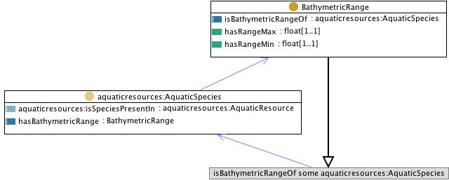

 __This pattern has been certified.__
Related submission, with evaluation history, can be found __here__

#  Graphical representation

__Diagram__

#  General description

  

#  Elements

_The __SpeciesBathymetry__ Content OP locally defines the following ontology elements:_

 __BathymetricRange__ (owl:Class) This class contains the set of bathymetric ranges. Bathymetry is numeric depth information about the ranges in which an aquatic species is found.
It can be mapped to fi:Bathymetry. 

  _[BathymetricRange](../Submissions/SpeciesBathymetry/BathymetricRange.md "Submissions:SpeciesBathymetry/BathymetricRange") page_
 __hasBathymetricRange__ (owl:ObjectProperty) has bathymetric range 
  _[hasBathymetricRange](../Submissions/SpeciesBathymetry/hasBathymetricRange.md "Submissions:SpeciesBathymetry/hasBathymetricRange") page_
 __isBathymetricRangeOf__ (owl:ObjectProperty) is bathymetric range of 
  _[isBathymetricRangeOf](../Submissions/SpeciesBathymetry/isBathymetricRangeOf.md "Submissions:SpeciesBathymetry/isBathymetricRangeOf") page_
 __hasRangeMin__ (owl:DatatypeProperty) 
  _[hasRangeMin](../Submissions/SpeciesBathymetry/hasRangeMin.md "Submissions:SpeciesBathymetry/hasRangeMin") page_
 __hasRangeMax__ (owl:DatatypeProperty) 
  _[hasRangeMax](../Submissions/SpeciesBathymetry/hasRangeMax.md "Submissions:SpeciesBathymetry/hasRangeMax") page_
#  Additional information

This pattern encodes a FSDAS competency question, with an indication to use some AquaticSpecies class, and some hasBathymetricRange property, with range BathymetricRange.

(type): [http://www.w3.org/2002/07/owl#Ontology](http://www.w3.org/2002/07/owl#Ontology "http://www.w3.org/2002/07/owl#Ontology")

(versionInfo): Created by Aldo Gangemi

(imports): [http://www.ontologydesignpatterns.org/cp/owl/fsdas/aquaticresources.owl](http://www.ontologydesignpatterns.org/cp/owl/fsdas/aquaticresources.owl "http://www.ontologydesignpatterns.org/cp/owl/fsdas/aquaticresources.owl")

(imports): [http://www.ontologydesignpatterns.org/schemas/cpannotationschema.owl](http://www.ontologydesignpatterns.org/schemas/cpannotationschema.owl "http://www.ontologydesignpatterns.org/schemas/cpannotationschema.owl")

(comment): This pattern encodes a FSDAS competency question, with an indication to use some AquaticSpecies class, and some hasBathymetricRange property, with range BathymetricRange.

(versionInfo): 1.0

#  Scenarios

__Scenarios about SpeciesBathymetry__
No scenario is added to this Content OP.

#  Reviews

__Reviews about SpeciesBathymetry__
This revision (revision ID __9123__) takes in account the reviews: none

Other info at [evaluation tab](http://ontologydesignpatterns.org/wiki/index.php?title=Submissions:SpeciesBathymetry&action=evaluation "http://ontologydesignpatterns.org/wiki/index.php?title=Submissions:SpeciesBathymetry&action=evaluation")

  

#  Modeling issues

__Modeling issues about SpeciesBathymetry__
There is no Modeling issue related to this proposal.

  

#  References

[Add a reference](index.php@title=Odp%253AAdd_reference&subject=../Submissions/SpeciesBathymetry.md "http://ontologydesignpatterns.org/wiki/index.php?title=Odp:Add_reference&subject=Submissions%3ASpeciesBathymetry")

  

Retrieved from "[http://ontologydesignpatterns.org/wiki/Submissions:SpeciesBathymetry](../Submissions/SpeciesBathymetry.md)"
 [Category](http://ontologydesignpatterns.org/wiki/Special:Categories "Special:Categories"): [ProposedContentOP](../Category/ProposedContentOP.md "Category:ProposedContentOP")