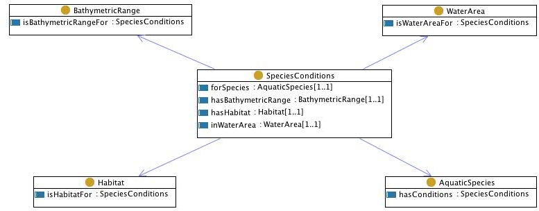

 __This pattern has been certified.__
Related submission, with evaluation history, can be found __here__

#  General description

  

#  Elements

_The __SpeciesConditions__ Content OP locally defines the following ontology elements:_

 __Habitat__ (owl:Class) Habitat is the biological and ecological context of a species in the area of an aquatic resource. 
  _[Habitat](../Submissions/SpeciesConditions/Habitat.md "Submissions:SpeciesConditions/Habitat") page_
 __SpeciesConditions__ (owl:Class) A class that allows to represent the typical physic conditions (bathymetry, habitat) of an aquatic species for a certain water area. 
  _[SpeciesConditions](../Submissions/SpeciesConditions/SpeciesConditions.md "Submissions:SpeciesConditions/SpeciesConditions") page_
 __AquaticSpecies__ (owl:Class) Aquatic species is characterized together with resources and water areas. 
Mappable to fi:Species, fi:SpeciesRef, fi:SpeciesFeature, etc.

It has related axioms from FIGIS Schema that are included in the classes linked to the fi:Species class, such as fi:SpeciesRef (holding association with fi:AqResRef, which holds association with fi:WaterAreaRef). 

  _[AquaticSpecies](../Submissions/SpeciesConditions/AquaticSpecies.md "Submissions:SpeciesConditions/AquaticSpecies") page_
 __BathymetricRange__ (owl:Class) This class contains the set of bathymetric ranges. Bathymetry is numeric depth information about the ranges in which an aquatic species is found.
It can be mapped to fi:Bathymetry. 

  _[BathymetricRange](../Submissions/SpeciesConditions/BathymetricRange.md "Submissions:SpeciesConditions/BathymetricRange") page_
 __WaterArea__ (owl:Class) 
  _[WaterArea](../Submissions/SpeciesConditions/WaterArea.md "Submissions:SpeciesConditions/WaterArea") page_
 __hasHabitat__ (owl:ObjectProperty) 
  _[hasHabitat](../Submissions/SpeciesConditions/hasHabitat.md "Submissions:SpeciesConditions/hasHabitat") page_
 __inWaterArea__ (owl:ObjectProperty) 
  _[inWaterArea](../Submissions/SpeciesConditions/inWaterArea.md "Submissions:SpeciesConditions/inWaterArea") page_
 __hasBathymetricRange__ (owl:ObjectProperty) 
  _[hasBathymetricRange](../Submissions/SpeciesConditions/hasBathymetricRange.md "Submissions:SpeciesConditions/hasBathymetricRange") page_
 __forSpecies__ (owl:ObjectProperty) 
  _[forSpecies](../Submissions/SpeciesConditions/forSpecies.md "Submissions:SpeciesConditions/forSpecies") page_
 __hasConditions__ (owl:ObjectProperty) 
  _[hasConditions](../Submissions/SpeciesConditions/hasConditions.md "Submissions:SpeciesConditions/hasConditions") page_
 __isWaterAreaFor__ (owl:ObjectProperty) 
  _[isWaterAreaFor](../Submissions/SpeciesConditions/isWaterAreaFor.md "Submissions:SpeciesConditions/isWaterAreaFor") page_
 __isHabitatFor__ (owl:ObjectProperty) 
  _[isHabitatFor](../Submissions/SpeciesConditions/isHabitatFor.md "Submissions:SpeciesConditions/isHabitatFor") page_
 __isBathymetricRangeFor__ (owl:ObjectProperty) 
  _[isBathymetricRangeFor](../Submissions/SpeciesConditions/isBathymetricRangeFor.md "Submissions:SpeciesConditions/isBathymetricRangeFor") page_
A pattern, based on situation.owl, which allow to express the typical 'conditions' (habitat, bathymetric range) of a species for a certain water area.

(type): [http://www.w3.org/2002/07/owl#Ontology](http://www.w3.org/2002/07/owl#Ontology "http://www.w3.org/2002/07/owl#Ontology")

(imports): [http://www.ontologydesignpatterns.org/cp/owl/situation.owl](http://www.ontologydesignpatterns.org/cp/owl/situation.owl "http://www.ontologydesignpatterns.org/cp/owl/situation.owl")

(versionInfo): 1.0

(comment): A pattern, based on situation.owl, which allow to express the typical 'conditions' (habitat, bathymetric range) of a species for a certain water area.

(imports): [http://www.ontologydesignpatterns.org/schemas/cpannotationschema.owl](http://www.ontologydesignpatterns.org/schemas/cpannotationschema.owl "http://www.ontologydesignpatterns.org/schemas/cpannotationschema.owl")

#  Scenarios

__Scenarios about SpeciesConditions__
No scenario is added to this Content OP.

#  Reviews

__Reviews about SpeciesConditions__
This revision (revision ID __3676__) takes in account the reviews: none

Other info at [evaluation tab](http://ontologydesignpatterns.org/wiki/index.php?title=Submissions:SpeciesConditions&action=evaluation "http://ontologydesignpatterns.org/wiki/index.php?title=Submissions:SpeciesConditions&action=evaluation")

Retrieved from "[http://ontologydesignpatterns.org/wiki/Submissions:SpeciesConditions](../Submissions/SpeciesConditions.md)"
 [Category](http://ontologydesignpatterns.org/wiki/Special:Categories "Special:Categories"): [ProposedContentOP](../Category/ProposedContentOP.md "Category:ProposedContentOP")