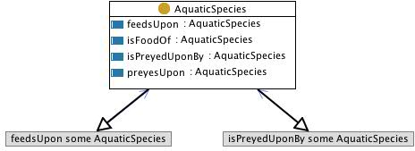

 __This pattern has been certified.__
Related submission, with evaluation history, can be found __here__

#  Graphical representation

__Diagram__

#  General description

  

#  Elements

_The __SpeciesEat__ Content OP locally defines the following ontology elements:_

 __AquaticSpecies__ (owl:Class) Aquatic species are conceptual entities that are characterized together with resources and water areas. 
Mappable to fi:Species, fi:SpeciesRef, fi:SpeciesFeature, etc.

It has related axioms from FIGIS Schema that are included in the classes linked to the fi:Species class, such as fi:SpeciesRef (holding association with fi:AqResRef, which holds association with fi:WaterAreaRef). 

  _[AquaticSpecies](../Submissions/SpeciesEat/AquaticSpecies.md "Submissions:SpeciesEat/AquaticSpecies") page_
 __feedsUpon__ (owl:ObjectProperty) 
  _[feedsUpon](../Submissions/SpeciesEat/feedsUpon.md "Submissions:SpeciesEat/feedsUpon") page_
 __isPreyedUponBy__ (owl:ObjectProperty) 
  _[isPreyedUponBy](../Submissions/SpeciesEat/isPreyedUponBy.md "Submissions:SpeciesEat/isPreyedUponBy") page_
 __isFoodOf__ (owl:ObjectProperty) 
  _[isFoodOf](../Submissions/SpeciesEat/isFoodOf.md "Submissions:SpeciesEat/isFoodOf") page_
 __preyesUpon__ (owl:ObjectProperty) 
  _[preyesUpon](../Submissions/SpeciesEat/preyesUpon.md "Submissions:SpeciesEat/preyesUpon") page_
#  Additional information

(type): [http://www.w3.org/2002/07/owl#Ontology](http://www.w3.org/2002/07/owl#Ontology "http://www.w3.org/2002/07/owl#Ontology")

(imports): [http://www.ontologydesignpatterns.org/schemas/cpannotationschema.owl](http://www.ontologydesignpatterns.org/schemas/cpannotationschema.owl "http://www.ontologydesignpatterns.org/schemas/cpannotationschema.owl")

(hasUnitTest): SELECT ?x WHERE {?x a :AquaticSpecies.  ?x :feedsUpon :Shrimp. }
SELECT ?x WHERE {?x a :AquaticSpecies.  :Shrimp :isEatenBy ?x. }
SELECT ?x WHERE {?x a :AquaticSpecies.  ?x :isPreyedUponBy :Seals.}
SELECT ?x WHERE {?x a :AquaticSpecies.  :Seals :preyesUpon ?x.}

#  Scenarios

__Scenarios about SpeciesEat__
No scenario is added to this Content OP.

#  Reviews

__Reviews about SpeciesEat__
There is no review about this proposal.
This revision (revision ID __9126__) takes in account the reviews: none

Other info at [evaluation tab](http://ontologydesignpatterns.org/wiki/index.php?title=Submissions:SpeciesEat&action=evaluation "http://ontologydesignpatterns.org/wiki/index.php?title=Submissions:SpeciesEat&action=evaluation")

  

#  Modeling issues

__Modeling issues about SpeciesEat__
There is no Modeling issue related to this proposal.

  

#  References

[Add a reference](index.php@title=Odp%253AAdd_reference&subject=../Submissions/SpeciesEat.md "http://ontologydesignpatterns.org/wiki/index.php?title=Odp:Add_reference&subject=Submissions%3ASpeciesEat")

  

Retrieved from "[http://ontologydesignpatterns.org/wiki/Submissions:SpeciesEat](../Submissions/SpeciesEat.md)"
 [Category](http://ontologydesignpatterns.org/wiki/Special:Categories "Special:Categories"): [ProposedContentOP](../Category/ProposedContentOP.md "Category:ProposedContentOP")