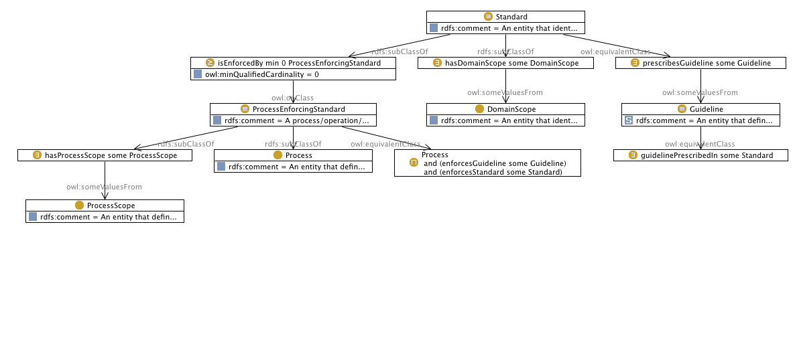

 __This pattern has been certified.__
Related submission, with evaluation history, can be found __here__

#  Graphical representation

__Diagram__

#  General description

  

#  Elements

_The __Standard Enforcer Pattern__ Content OP locally defines the following ontology elements:_

 __enforcesGuideline__ (owl:ObjectProperty) 
  _[enforcesGuideline](../Submissions/Standard_Enforcer_Pattern/enforcesGuideline.md "Submissions:Standard Enforcer Pattern/enforcesGuideline") page_
 __enforcesStandard__ (owl:ObjectProperty) 
  _[enforcesStandard](../Submissions/Standard_Enforcer_Pattern/enforcesStandard.md "Submissions:Standard Enforcer Pattern/enforcesStandard") page_
 __guidelinePrescribedIn__ (owl:ObjectProperty) 
  _[guidelinePrescribedIn](../Submissions/Standard_Enforcer_Pattern/guidelinePrescribedIn.md "Submissions:Standard Enforcer Pattern/guidelinePrescribedIn") page_
 __hasDomainScope__ (owl:ObjectProperty) 
  _[hasDomainScope](../Submissions/Standard_Enforcer_Pattern/hasDomainScope.md "Submissions:Standard Enforcer Pattern/hasDomainScope") page_
 __hasProcessScope__ (owl:ObjectProperty) 
  _[hasProcessScope](../Submissions/Standard_Enforcer_Pattern/hasProcessScope.md "Submissions:Standard Enforcer Pattern/hasProcessScope") page_
 __isEnforcedBy__ (owl:ObjectProperty) 
  _[isEnforcedBy](../Submissions/Standard_Enforcer_Pattern/isEnforcedBy.md "Submissions:Standard Enforcer Pattern/isEnforcedBy") page_
 __prescribesGuideline__ (owl:ObjectProperty) 
  _[prescribesGuideline](../Submissions/Standard_Enforcer_Pattern/prescribesGuideline.md "Submissions:Standard Enforcer Pattern/prescribesGuideline") page_
 __DomainScope__ (owl:Class) An entity that identifies the domain level scope of the standard 
  _[DomainScope](../Submissions/Standard_Enforcer_Pattern/DomainScope.md "Submissions:Standard Enforcer Pattern/DomainScope") page_
 __Guideline__ (owl:Class) An entity that defines the guideline that is part of a standard 
  _[Guideline](../Submissions/Standard_Enforcer_Pattern/Guideline.md "Submissions:Standard Enforcer Pattern/Guideline") page_
 __Process__ (owl:Class) An entity that defines a workflow, operation, activity or a service 
  _[Process](../Submissions/Standard_Enforcer_Pattern/Process.md "Submissions:Standard Enforcer Pattern/Process") page_
 __ProcessEnforcingStandard__ (owl:Class) A process/operation/activity or serrvice that enforces one or more standard. 
  _[ProcessEnforcingStandard](../Submissions/Standard_Enforcer_Pattern/ProcessEnforcingStandard.md "Submissions:Standard Enforcer Pattern/ProcessEnforcingStandard") page_
 __ProcessScope__ (owl:Class) An entity that defines the scope of a process 
  _[ProcessScope](../Submissions/Standard_Enforcer_Pattern/ProcessScope.md "Submissions:Standard Enforcer Pattern/ProcessScope") page_
 __Standard__ (owl:Class) An entity that identifies a specification established through domain expert consensus that prescribes a set of rules and guidelines for a given context within the domain. 
  _[Standard](../Submissions/Standard_Enforcer_Pattern/Standard.md "Submissions:Standard Enforcer Pattern/Standard") page_
#  Additional information

This ontology models the standards enforcer pattern (SEP). The main advantage of this pattern is that it provides the capability
to link processes operation and activities to their governing
standards in a generic way. The pattern can be applied to all those
use cases where a standard is enforced.

#  Scenarios

__Scenarios about Standard Enforcer Pattern__
No scenario is added to this Content OP.

#  Reviews

__Reviews about Standard Enforcer Pattern__
This revision (revision ID __11210__) takes in account the reviews: none

Other info at [evaluation tab](http://ontologydesignpatterns.org/wiki/index.php?title=Submissions:Standard_Enforcer_Pattern&action=evaluation "http://ontologydesignpatterns.org/wiki/index.php?title=Submissions:Standard_Enforcer_Pattern&action=evaluation")

  

#  Modeling issues

__Modeling issues about Standard Enforcer Pattern__
There is no Modeling issue related to this proposal.

  

#  References

[Add a reference](index.php@title=Odp%253AAdd_reference&subject=Submissions%253AStandard+Enforcer+Pattern.html "http://ontologydesignpatterns.org/wiki/index.php?title=Odp:Add_reference&subject=Submissions%3AStandard+Enforcer+Pattern")

  

Retrieved from "[http://ontologydesignpatterns.org/wiki/Submissions:Standard\_Enforcer\_Pattern](../Submissions/Standard_Enforcer_Pattern.md)"
 [Categories](http://ontologydesignpatterns.org/wiki/Special:Categories "Special:Categories"): [ProposedContentOP](../Category/ProposedContentOP.md "Category:ProposedContentOP") | [Submitted to event](../Category/Submitted_to_event.md "Category:Submitted to event") | [Review assigned](../Category/Review_assigned.md "Category:Review assigned")