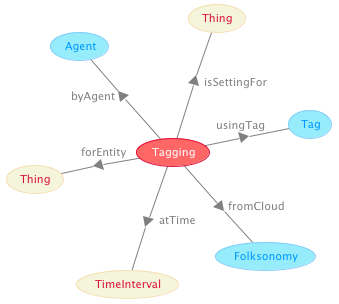

 __This pattern has been certified.__
Related submission, with evaluation history, can be found __here__

#  Graphical representation

__Diagram__

#  General description

  

#  Elements

_The __Tagging__ Content OP locally defines the following ontology elements:_

 __byAgent__ (owl:ObjectProperty) 
  _[byAgent](../Submissions/Tagging/byAgent "Submissions:Tagging/byAgent") page_
 __isTagUsedIn__ (owl:ObjectProperty) 
  _[isTagUsedIn](../Submissions/Tagging/isTagUsedIn "Submissions:Tagging/isTagUsedIn") page_
 __isTaggingAgentIn__ (owl:ObjectProperty) 
  _[isTaggingAgentIn](../Submissions/Tagging/isTaggingAgentIn "Submissions:Tagging/isTaggingAgentIn") page_
 __usingTag__ (owl:ObjectProperty) 
  _[usingTag](../Submissions/Tagging/usingTag "Submissions:Tagging/usingTag") page_
#  Additional information

The tagging ontology drafted by Tom Gruber in FOL, and formalized here in OWL by Aldo Gangemi with pattern-based design.
A Tag is here classified as a linguistic object that is used in the context of a Tagging Situation, which also involves a (tagged) Entity, an Agent, and a Folksonomy.

#  Scenarios

__Scenarios about Tagging__
No scenario is added to this Content OP.

#  Reviews

__Reviews about Tagging__
There is no review about this proposal.
This revision (revision ID __9129__) takes in account the reviews: none

Other info at [evaluation tab](http://ontologydesignpatterns.org/wiki/index.php?title=Submissions:Tagging&action=evaluation "http://ontologydesignpatterns.org/wiki/index.php?title=Submissions:Tagging&action=evaluation")

  

#  Modeling issues

__Modeling issues about Tagging__
There is no Modeling issue related to this proposal.

  

#  References

[Add a reference](index.php@title=Odp%253AAdd_reference&subject=../Submissions/Tagging "http://ontologydesignpatterns.org/wiki/index.php?title=Odp:Add_reference&subject=Submissions%3ATagging")

  

Retrieved from "[http://ontologydesignpatterns.org/wiki/Submissions:Tagging](../Submissions/Tagging)"
 [Category](http://ontologydesignpatterns.org/wiki/Special:Categories "Special:Categories"): [ProposedContentOP](../Category/ProposedContentOP "Category:ProposedContentOP")