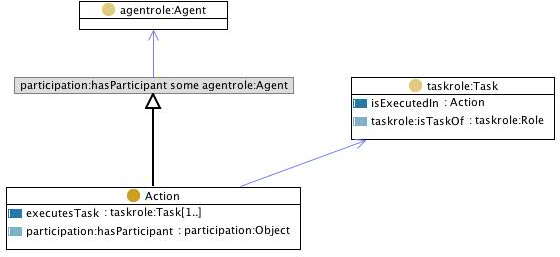

 __This pattern has been certified.__
Related submission, with evaluation history, can be found __here__

#  Graphical representation

__Diagram__

#  General description

  

#  Elements

_The __TaskExecution__ Content OP locally defines the following ontology elements:_

 __Action__ (owl:Class) An Event with at least one Agent that isParticipantIn it, and that executes a Task that typically isDefinedIn a Plan, Workflow, Project, etc. 
  _[Action](../Submissions/TaskExecution/Action "Submissions:TaskExecution/Action") page_
 __executesTask__ (owl:ObjectProperty) A relation between an action and a task, e.g. 'putting some water in a pot and putting the pot on a fire until the water starts bubbling' executes the task 'boiling'. 
  _[executesTask](../Submissions/TaskExecution/executesTask "Submissions:TaskExecution/executesTask") page_
 __isExecutedIn__ (owl:ObjectProperty) A relation between an action and a task, e.g. 'putting some water in a pot and putting the pot on a fire until the water starts bubbling' executes the task 'boiling'. 
  _[isExecutedIn](../Submissions/TaskExecution/isExecutedIn "Submissions:TaskExecution/isExecutedIn") page_
#  Additional information

(type): [http://www.w3.org/2002/07/owl#Ontology](http://www.w3.org/2002/07/owl#Ontology "http://www.w3.org/2002/07/owl#Ontology")

(relatedCPs): The Nary Classification CP available at [http://www.ontologydesignpatterns.org/cp/owl/naryclassification.owl](http://www.ontologydesignpatterns.org/cp/owl/naryclassification.owl "http://www.ontologydesignpatterns.org/cp/owl/naryclassification.owl") allows to represent temporariness of concepts that classify objects. By specializing naryclassification, it is possible to create a temporally-indexed version of taskexecution.
Its imported component taskrole.owl allows to express also the dependence between tasks and roles.

(imports): [http://www.ontologydesignpatterns.org/cp/owl/taskrole.owl](http://www.ontologydesignpatterns.org/cp/owl/taskrole.owl "http://www.ontologydesignpatterns.org/cp/owl/taskrole.owl")

(imports): [http://www.ontologydesignpatterns.org/cp/owl/participation.owl](http://www.ontologydesignpatterns.org/cp/owl/participation.owl "http://www.ontologydesignpatterns.org/cp/owl/participation.owl")

(scenarios): She smiled at us, so obtaining the effect of making us feeling positive.

(imports): [http://www.ontologydesignpatterns.org/cp/owl/agentrole.owl](http://www.ontologydesignpatterns.org/cp/owl/agentrole.owl "http://www.ontologydesignpatterns.org/cp/owl/agentrole.owl")

(versionInfo): Created by Aldo Gangemi

#  Scenarios

__Scenarios about TaskExecution__
No scenario is added to this Content OP.

#  Reviews

__Reviews about TaskExecution__
There is no review about this proposal.
This revision (revision ID __9131__) takes in account the reviews: none

Other info at [evaluation tab](http://ontologydesignpatterns.org/wiki/index.php?title=Submissions:TaskExecution&action=evaluation "http://ontologydesignpatterns.org/wiki/index.php?title=Submissions:TaskExecution&action=evaluation")

  

#  Modeling issues

__Modeling issues about TaskExecution__
There is no Modeling issue related to this proposal.

  

#  References

[Add a reference](index.php@title=Odp%253AAdd_reference&subject=../Submissions/TaskExecution "http://ontologydesignpatterns.org/wiki/index.php?title=Odp:Add_reference&subject=Submissions%3ATaskExecution")

  

Retrieved from "[http://ontologydesignpatterns.org/wiki/Submissions:TaskExecution](../Submissions/TaskExecution)"
 [Categories](http://ontologydesignpatterns.org/wiki/Special:Categories "Special:Categories"): [ProposedContentOP](../Category/ProposedContentOP "Category:ProposedContentOP") | [Waiting for review](../Category/Waiting_for_review "Category:Waiting for review")