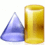

___isTimeOf__ has [Category:OntologyElement](../../Category/OntologyElement.md "Category:OntologyElement") and is an [element of](../../Property/ElementOf.md "Property:ElementOf") [TimeIndexedPartOf](../../Submissions/TimeIndexedPartOf.md "Submissions:TimeIndexedPartOf")_

  

__Name__: is time of 

__Type:__ owl:ObjectProperty 

__Description__: The inverse of the  [at time](../../Submissions/Pollution/atTime.md "Submissions:TimeIndexedPartOf/atTime") object property. 

Retrieved from "[http://ontologydesignpatterns.org/wiki/Submissions:TimeIndexedPartOf/isTimeOf](../../Submissions/TimeIndexedPartOf/isTimeOf.md)"
 [Category](http://ontologydesignpatterns.org/wiki/Special:Categories "Special:Categories"): [OntologyElement](../../Category/OntologyElement.md "Category:OntologyElement")