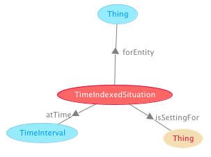

 __This pattern has been certified.__
Related submission, with evaluation history, can be found __here__

#  Graphical representation

__Diagram__

#  General description

  

#  Elements

_The __TimeIndexedSituation__ Content OP locally defines the following ontology elements:_

 __atTime__ (owl:ObjectProperty) 
  _[atTime](../Submissions/TimeIndexedSituation/atTime "Submissions:TimeIndexedSituation/atTime") page_
 __forEntity__ (owl:ObjectProperty) 
  _[forEntity](../Submissions/TimeIndexedSituation/forEntity "Submissions:TimeIndexedSituation/forEntity") page_
 __hasTimeIndexedSetting__ (owl:ObjectProperty) 
  _[hasTimeIndexedSetting](../Submissions/TimeIndexedSituation/hasTimeIndexedSetting "Submissions:TimeIndexedSituation/hasTimeIndexedSetting") page_
 __isTimeIndexFor__ (owl:ObjectProperty) 
  _[isTimeIndexFor](../Submissions/TimeIndexedSituation/isTimeIndexFor "Submissions:TimeIndexedSituation/isTimeIndexFor") page_
 __TimeIndexedSituation__ (owl:Class) A Situation that is explicitly indexed at some time for at least one entity. 
  _[TimeIndexedSituation](../Submissions/TimeIndexedSituation/TimeIndexedSituation "Submissions:TimeIndexedSituation/TimeIndexedSituation") page_
#  Additional information

A generic pattern usable for all situations that require a temporal indexing.

#  Scenarios

__Scenarios about TimeIndexedSituation__
No scenario is added to this Content OP.

#  Reviews

__Reviews about TimeIndexedSituation__
There is no review about this proposal.
This revision (revision ID __9135__) takes in account the reviews: none

Other info at [evaluation tab](http://ontologydesignpatterns.org/wiki/index.php?title=Submissions:TimeIndexedSituation&action=evaluation "http://ontologydesignpatterns.org/wiki/index.php?title=Submissions:TimeIndexedSituation&action=evaluation")

  

#  Modeling issues

__Modeling issues about TimeIndexedSituation__
There is no Modeling issue related to this proposal.

  

#  References

[Add a reference](index.php@title=Odp%253AAdd_reference&subject=../Submissions/TimeIndexedSituation "http://ontologydesignpatterns.org/wiki/index.php?title=Odp:Add_reference&subject=Submissions%3ATimeIndexedSituation")

  

Retrieved from "[http://ontologydesignpatterns.org/wiki/Submissions:TimeIndexedSituation](../Submissions/TimeIndexedSituation)"
 [Category](http://ontologydesignpatterns.org/wiki/Special:Categories "Special:Categories"): [ProposedContentOP](../Category/ProposedContentOP "Category:ProposedContentOP")