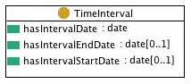

 __This pattern has been certified.__
Related submission, with evaluation history, can be found __here__

#  Graphical representation

__Diagram__

#  General description

  

#  Elements

_The __TimeInterval__ Content OP locally defines the following ontology elements:_

 __Time Interval__ (owl:Class) Any region in a dimensional space that represents time. 

  _[TimeInterval](../Submissions/TimeInterval/TimeInterval.md "Submissions:TimeInterval/TimeInterval") page_

 __has interval date__ (owl:DatatypeProperty) A datatype property that encodes values from xsd:date for a time interval; a 
same time interval can have more than one xsd:date value: begin date, end date, date at which the interval holds, as well as dates expressed in different formats: xsd:gYear, xsd:dateTime, etc. 

  _[hasIntervalDate](../Submissions/TimeInterval/hasIntervalDate.md "Submissions:TimeInterval/hasIntervalDate") page_

 __has interval start date__ (owl:DatatypeProperty) The start date of a  [time interval](../Submissions/TimeInterval/TimeInterval.md "Submissions:TimeInterval/TimeInterval"). 

  _[hasIntervalStartDate](../Submissions/TimeInterval/hasIntervalStartDate.md "Submissions:TimeInterval/hasIntervalStartDate") page_

 __has interval end date__ (owl:DatatypeProperty) The end date of a  [time interval](../Submissions/TimeInterval/TimeInterval.md "Submissions:TimeInterval/TimeInterval"). 

  _[hasIntervalEndDate](../Submissions/TimeInterval/hasIntervalEndDate.md "Submissions:TimeInterval/hasIntervalEndDate") page_
#  Additional information

This Content OP can be composed with other Content OPs when temporal aspects need to be represented.

#  Scenarios

__Scenarios about TimeInterval__
No scenario is added to this Content OP.

#  Reviews

__Reviews about TimeInterval__
There is no review about this proposal.
This revision (revision ID __9136__) takes in account the reviews: none

Other info at [evaluation tab](http://ontologydesignpatterns.org/wiki/index.php?title=Submissions:TimeInterval&action=evaluation "http://ontologydesignpatterns.org/wiki/index.php?title=Submissions:TimeInterval&action=evaluation")

  

#  Modeling issues

__Modeling issues about TimeInterval__
There is no Modeling issue related to this proposal.

  

#  References

[Add a reference](index.php@title=Odp%253AAdd_reference&subject=../Submissions/TimeInterval.md "http://ontologydesignpatterns.org/wiki/index.php?title=Odp:Add_reference&subject=Submissions%3ATimeInterval")

  

Retrieved from "[http://ontologydesignpatterns.org/wiki/Submissions:TimeInterval](../Submissions/TimeInterval.md)"
 [Category](http://ontologydesignpatterns.org/wiki/Special:Categories "Special:Categories"): [ProposedContentOP](../Category/ProposedContentOP.md "Category:ProposedContentOP")