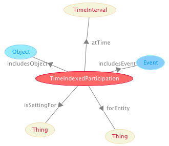

 __This pattern has been certified.__
Related submission, with evaluation history, can be found __here__

#  Graphical representation

__Diagram__

#  General description

  

#  Elements

_The __Time indexed participation__ Content OP locally defines the following ontology elements:_

 __includesEvent__ (owl:ObjectProperty) A relation between situations and events, e.g. 'this morning I've prepared my coffee and had my fingers burnt' (i.e.: the preparation of my coffee this morning included a burning of my fingers). 
  _[includesEvent](../Submissions/Time_indexed_participation/includesEvent.md "Submissions:Time indexed participation/includesEvent") page_
 __includesObject__ (owl:ObjectProperty) A relation between situations and objects, e.g. 'this morning I've prepared my coffee and had my fingers burnt' (i.e.: the preparation of my coffee this morning included me). 
  _[includesObject](../Submissions/Time_indexed_participation/includesObject.md "Submissions:Time indexed participation/includesObject") page_
 __isEventIncludedIn__ (owl:ObjectProperty) 
  _[isEventIncludedIn](../Submissions/Time_indexed_participation/isEventIncludedIn.md "Submissions:Time indexed participation/isEventIncludedIn") page_
 __isObjectIncludedIn__ (owl:ObjectProperty) 
  _[isObjectIncludedIn](../Submissions/Time_indexed_participation/isObjectIncludedIn.md "Submissions:Time indexed participation/isObjectIncludedIn") page_
 __TimeIndexedParticipation__ (owl:Class) A Situation that represents participation of Object(s) in Event(s) at some Time. 
  _[TimeIndexedParticipation](../Submissions/Time_indexed_participation/TimeIndexedParticipation.md "Submissions:Time indexed participation/TimeIndexedParticipation") page_
#  Additional information

A time-indexed pattern for participation

#  Scenarios

__Scenarios about Time indexed participation__
No scenario is added to this Content OP.

#  Reviews

__Reviews about Time indexed participation__
There is no review about this proposal.
This revision (revision ID __9130__) takes in account the reviews: none

Other info at [evaluation tab](http://ontologydesignpatterns.org/wiki/index.php?title=Submissions:Time_indexed_participation&action=evaluation "http://ontologydesignpatterns.org/wiki/index.php?title=Submissions:Time_indexed_participation&action=evaluation")

  

#  Modeling issues

__Modeling issues about Time indexed participation__
There is no Modeling issue related to this proposal.

  

#  References

[Add a reference](index.php@title=Odp%253AAdd_reference&subject=Submissions%253ATime+indexed+participation.html "http://ontologydesignpatterns.org/wiki/index.php?title=Odp:Add_reference&subject=Submissions%3ATime+indexed+participation")

  

Retrieved from "[http://ontologydesignpatterns.org/wiki/Submissions:Time\_indexed\_participation](../Submissions/Time_indexed_participation.md)"
 [Category](http://ontologydesignpatterns.org/wiki/Special:Categories "Special:Categories"): [ProposedContentOP](../Category/ProposedContentOP.md "Category:ProposedContentOP")