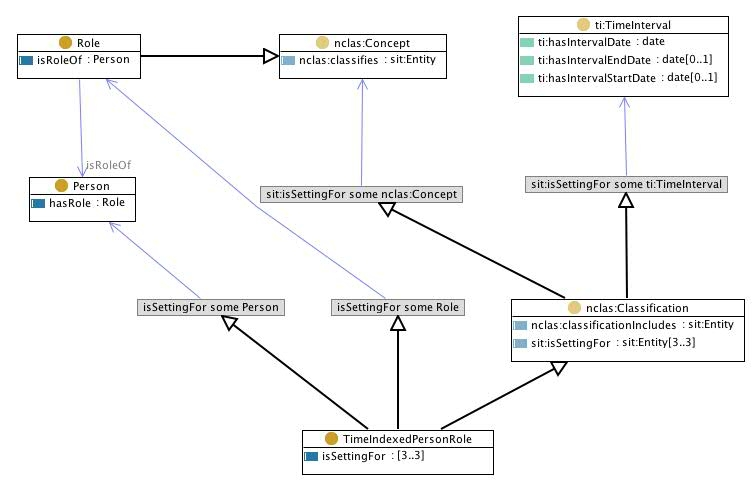

 __This pattern has been certified.__
Related submission, with evaluation history, can be found __here__

#  Graphical representation

__Diagram__

#  General description

  

#  Elements

_The __Time indexed person role__ Content OP locally defines the following ontology elements:_

 __Person__ (owl:Class) Persons in commonsense intuition, i.e. either as physical agents (humans) or social persons. 
  _[Person](../Submissions/Time_indexed_person_role/Person "Submissions:Time indexed person role/Person") page_
 __TimeIndexedPersonRole__ (owl:Class) A situation that expresses time indexing for the relation between persons and roles they play. 
  _[TimeIndexedPersonRole](../Submissions/Time_indexed_person_role/TimeIndexedPersonRole "Submissions:Time indexed person role/TimeIndexedPersonRole") page_
#  Additional information

(type): [http://www.w3.org/2002/07/owl#Ontology](http://www.w3.org/2002/07/owl#Ontology "http://www.w3.org/2002/07/owl#Ontology")

(imports): [http://www.ontologydesignpatterns.org/cp/owl/agentrole.owl](http://www.ontologydesignpatterns.org/cp/owl/agentrole.owl "http://www.ontologydesignpatterns.org/cp/owl/agentrole.owl")

(imports): [http://www.ontologydesignpatterns.org/cp/owl/classification.owl](http://www.ontologydesignpatterns.org/cp/owl/classification.owl "http://www.ontologydesignpatterns.org/cp/owl/classification.owl")

(versionInfo): Created with TopBraid Composer

(imports): [http://www.ontologydesignpatterns.org/cp/owl/naryclassification.owl](http://www.ontologydesignpatterns.org/cp/owl/naryclassification.owl "http://www.ontologydesignpatterns.org/cp/owl/naryclassification.owl")

(imports): [http://www.ontologydesignpatterns.org/cp/owl/objectrole.owl](http://www.ontologydesignpatterns.org/cp/owl/objectrole.owl "http://www.ontologydesignpatterns.org/cp/owl/objectrole.owl")

(imports): [http://www.ontologydesignpatterns.org/schemas/cpannotationschema.owl](http://www.ontologydesignpatterns.org/schemas/cpannotationschema.owl "http://www.ontologydesignpatterns.org/schemas/cpannotationschema.owl")

#  Scenarios

__Scenarios about Time indexed person role__
No scenario is added to this Content OP.

#  Reviews

__Reviews about Time indexed person role__
There is no review about this proposal.
This revision (revision ID __9132__) takes in account the reviews: none

Other info at [evaluation tab](http://ontologydesignpatterns.org/wiki/index.php?title=Submissions:Time_indexed_person_role&action=evaluation "http://ontologydesignpatterns.org/wiki/index.php?title=Submissions:Time_indexed_person_role&action=evaluation")

  

#  Modeling issues

__Modeling issues about Time indexed person role__
There is no Modeling issue related to this proposal.

  

#  References

[Add a reference](index.php@title=Odp%253AAdd_reference&subject=Submissions%253ATime+indexed+person+role.html "http://ontologydesignpatterns.org/wiki/index.php?title=Odp:Add_reference&subject=Submissions%3ATime+indexed+person+role")

  

Retrieved from "[http://ontologydesignpatterns.org/wiki/Submissions:Time\_indexed\_person\_role](../Submissions/Time_indexed_person_role)"
 [Category](http://ontologydesignpatterns.org/wiki/Special:Categories "Special:Categories"): [ProposedContentOP](../Category/ProposedContentOP "Category:ProposedContentOP")