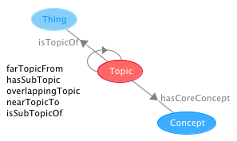

 __This pattern has been certified.__
Related submission, with evaluation history, can be found __here__

#  Graphical representation

__Diagram__

#  General description

  

#  Elements

_The __Topic__ Content OP locally defines the following ontology elements:_

 __farTopicFrom__ (owl:ObjectProperty) The opposite to vicinity relation between two topics, e.g. 'star system' (as a Topic) is farTopicFrom 'geology' (as a Topic).
Distance is typically established with reference to a threshold on the number of concepts or entities that are common between the two topics. Alternatively, it can be established with reference to the a geometrical semantics applied to the spaces (super-topics) of which topics are part (cf. ontopic.owl ontology). 

  _[farTopicFrom](../Submissions/Topic/farTopicFrom.md "Submissions:Topic/farTopicFrom") page_
 __hasCoreConcept__ (owl:ObjectProperty) A Concept is a core concept for a Topic when it can classify many entities that have that Topic.
For example, Saxophone (as a Concept) isCoreConceptFor Saxophones (as a Topic). 

  _[hasCoreConcept](../Submissions/Topic/hasCoreConcept.md "Submissions:Topic/hasCoreConcept") page_
 __hasSubTopic__ (owl:ObjectProperty) The relation between two instances of a Topic, in terms of their cultural coverage. For example, Sport hasSubTopic Football. 
It can be used widely to talk about document annotations, subject directories, etc. 

  _[hasSubTopic](../Submissions/Topic/hasSubTopic.md "Submissions:Topic/hasSubTopic") page_
 __hasTopic__ (owl:ObjectProperty) The relation between something and its Topic (subject, argument, domain, theme, subject area, etc.). It can be used widely to talk about document annotations, subject directories, etc.
hasTopic is very general. For example, consider the following cases:

(1) A biography of Brigitte Bardot hasTopic 'star system'

(2) The concept of 'starlet' hasTopic 'cinema'

(3) A biography of Claude Chabrol hasTopic 'Nouvelle Vague'. 

  _[hasTopic](../Submissions/Topic/hasTopic.md "Submissions:Topic/hasTopic") page_
 __isCoreConceptFor__ (owl:ObjectProperty) A Concept is a core concept for a Topic when it can classify many entities that have that Topic.
For example, Saxophone (as a Concept) isCoreConceptFor Saxophones (as a Topic). 

  _[isCoreConceptFor](../Submissions/Topic/isCoreConceptFor.md "Submissions:Topic/isCoreConceptFor") page_
 __isSubTopicOf__ (owl:ObjectProperty) The relation between two Topic(s), in terms of their cultural coverage. For example, Football isSubTopicOf Sport. 
It can be used widely to talk about document annotations, subject directories, etc. 

  _[isSubTopicOf](../Submissions/Topic/isSubTopicOf.md "Submissions:Topic/isSubTopicOf") page_
 __isTopicOf__ (owl:ObjectProperty) The relation between something and its Topic (subject, argument, domain, theme, subject area, etc.). It can be used widely to talk about document annotations, subject directories, etc.
hasTopic is very general. For example, consider the following cases:

(1) A biography of Brigitte Bardot hasTopic 'star system'

(2) The concept of 'starlet' hasTopic 'cinema'

(3) A biography of Claude Chabrol hasTopic 'Nouvelle Vague'. 

  _[isTopicOf](../Submissions/Topic/isTopicOf.md "Submissions:Topic/isTopicOf") page_
 __nearTopicTo__ (owl:ObjectProperty) The vicinity relation between two topics, e.g. 'star system' (as a Topic) is nearTopicTo 'cinema' (as a Topic).
Vicinity is typically established with reference to a threshold on the number of concepts or entities that are common to the two Topic(s), or based on a geometrical semantics applied to the spaces common between two topics (cf. ontopic.owl ontology). 

  _[nearTopicTo](../Submissions/Topic/nearTopicTo.md "Submissions:Topic/nearTopicTo") page_
 __overlappingTopic__ (owl:ObjectProperty) The relation between two topics, e.g. 'star system' (as a Topic) is overlappingTopic with 'Bollywood movies' (as a Topic).
Overlap is typically established with reference to a threshold on the number of concepts or entities that are common between the two topics. Alternatively, it can be established with reference to the a geometrical semantics applied to the spaces (super-topics) of which topics are part (cf. ontopic.owl ontology). 

  _[overlappingTopic](../Submissions/Topic/overlappingTopic.md "Submissions:Topic/overlappingTopic") page_
 __Concept__ (owl:Class) A Concept is a social object, which is used to classify entities. Differently from a Topic
Both concepts and topics are used to classify entities, but concepts typically have an "is a" relation to the entities; e.g. 

(1) A biography of Brigitte Bardot hasTopic 'star system' (Topic)

(2) A biography of Brigitte Bardot is a Biography (Concept)

(3) A biography of Claude Chabrol hasTopic 'Nouvelle Vague' (Topic)

(4) The Nouvelle Vague is a CulturalMovement (Concept) 

  _[Concept](../Submissions/Topic/Concept.md "Submissions:Topic/Concept") page_
 __Topic__ (owl:Class) A topic, or subject, argument, domain, theme, subject area, etc.
Topics have a controversial intuition across common sense, document management systems, knowledge organization systems, etc.

  

There is an interesting duality of topics: they are commonly interpreted as areas of shared knowledge within a Community (therefore as collections of social objects). On the other hand, existing directories and thesauri use 'topic' (or 'subject') more restrictively, as a relation between a document and a concept. 

  

For example, thesauri do not usually distinguish when their 'concepts' (cf. skos:Concept) are actually intended as concepts (in the sense of Concept in this pattern) and when they are intended as topics. The distinction is clear when you compare these two sample sentences: 'the football topic is part of the sport topic' vs. 'the concept of football is part of the concept of sport'. 

While the first is perfectly acceptable, the second is counterintuitive and even possibly wrong. This effect is due to the fact that concepts are 'intensional' notions and are not intended as areas of knowledge, document spaces, etc., which are 'extensional' notions.

  

Accordingly to these basic observations, in this pattern Concept and Topic result to be disjoint, and an appropriate representation should be in place in order to model thesauri. E.g. skos:Concept should be mapped to the union of Concept and Topic. 

  _[Topic](../Submissions/Topic/Topic.md "Submissions:Topic/Topic") page_
#  Additional information

It is a simplified version of the ontology [http://ontologydesignpatterns.org/ont/dul/ontopic.owl](http://ontologydesignpatterns.org/ont/dul/ontopic.owl "http://ontologydesignpatterns.org/ont/dul/ontopic.owl")

#  Scenarios

__Scenarios about Topic__
No scenario is added to this Content OP.

#  Reviews

__Reviews about Topic__
There is no review about this proposal.
This revision (revision ID __9138__) takes in account the reviews: none

Other info at [evaluation tab](http://ontologydesignpatterns.org/wiki/index.php?title=Submissions:Topic&action=evaluation "http://ontologydesignpatterns.org/wiki/index.php?title=Submissions:Topic&action=evaluation")

  

#  Modeling issues

__Modeling issues about Topic__
There is no Modeling issue related to this proposal.

  

#  References

[Add a reference](index.php@title=Odp%253AAdd_reference&subject=../Submissions/Topic.md "http://ontologydesignpatterns.org/wiki/index.php?title=Odp:Add_reference&subject=Submissions%3ATopic")

  

Retrieved from "[http://ontologydesignpatterns.org/wiki/Submissions:Topic](../Submissions/Topic.md)"
 [Category](http://ontologydesignpatterns.org/wiki/Special:Categories "Special:Categories"): [ProposedContentOP](../Category/ProposedContentOP.md "Category:ProposedContentOP")