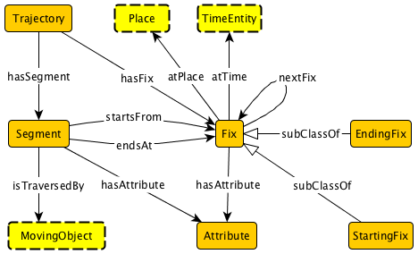

 __This pattern has been certified.__
Related submission, with evaluation history, can be found __here__

#  Graphical representation

__Diagram__

#  General description

  

#  Elements

_The __Trajectory__ Content OP locally defines the following ontology elements:_

 __atPlace__ (owl:ObjectProperty) Connects anything (including fixes in this pattern) to Place. 
  _[atPlace](../Submissions/Trajectory/atPlace.md "Submissions:Trajectory/atPlace") page_
 __atTime__ (owl:ObjectProperty) Connects anything (including fixes in this pattern) to TimeEntity 
  _[atTime](../Submissions/Trajectory/atTime.md "Submissions:Trajectory/atTime") page_
 __endsAt__ (owl:ObjectProperty) Connects a segment to the fix it ends at. 
  _[endsAt](../Submissions/Trajectory/endsAt.md "Submissions:Trajectory/endsAt") page_
 __hasAttribute__ (owl:ObjectProperty) Connects a fix or a segment to an additional information as represented by an instance of Attribute. 
  _[hasAttribute](../Submissions/Trajectory/hasAttribute.md "Submissions:Trajectory/hasAttribute") page_
 __hasFix__ (owl:ObjectProperty) Relating the trajectory to each of its fixes. 
  _[hasFix](../Submissions/Trajectory/hasFix.md "Submissions:Trajectory/hasFix") page_
 __hasSegment__ (owl:ObjectProperty) Relating the trajectory to each of its segments. 
  _[hasSegment](../Submissions/Trajectory/hasSegment.md "Submissions:Trajectory/hasSegment") page_
 __hasTrajectory__ (owl:ObjectProperty) Anything that has a trajectory can use this property to connect it to the trajectory instance. 
  _[hasTrajectory](../Submissions/Trajectory/hasTrajectory.md "Submissions:Trajectory/hasTrajectory") page_
 __nextFix__ (owl:ObjectProperty) Relates one fix to the immediately following fix in the sequence. 
  _[nextFix](../Submissions/Trajectory/nextFix.md "Submissions:Trajectory/nextFix") page_
 __startsFrom__ (owl:ObjectProperty) Connects a segment to the fix it starts from. 
  _[startsFrom](../Submissions/Trajectory/startsFrom.md "Submissions:Trajectory/startsFrom") page_
 __traversedBy__ (owl:ObjectProperty) Connect a segment to the moving object that traverses it. 
  _[traversedBy](../Submissions/Trajectory/traversedBy.md "Submissions:Trajectory/traversedBy") page_
 __Attribute__ (owl:Class) Captures additional information that enriches some fix or segment. 
  _[Attribute](../Submissions/Trajectory/Attribute.md "Submissions:Trajectory/Attribute") page_
 __EndingFix__ (owl:Class) The last fix in a particular sequence of fixes. 
  _[EndingFix](../Submissions/Trajectory/EndingFix.md "Submissions:Trajectory/EndingFix") page_
 __Fix__ (owl:Class) Describes a fix, which is an adorned spatiotemporal point. A sequence of fixes form the trajectory. 
  _[Fix](../Submissions/Trajectory/Fix.md "Submissions:Trajectory/Fix") page_
 __MovingObject__ (owl:Class) This is the hook to an ontology/pattern that describes the moving object, if any, which moves along the trajectory. 
  _[MovingObject](../Submissions/Trajectory/MovingObject.md "Submissions:Trajectory/MovingObject") page_
 __Place__ (owl:Class) This is the hook to other pattern/ontology that describes the notion of place, which is more general than just a location/geo-coordinate. 
  _[Place](../Submissions/Trajectory/Place.md "Submissions:Trajectory/Place") page_
 __Segment__ (owl:Class) The Segment class captures the "connection" between two consecutive fixes. That is, a segment starts from a fix and ends at another fix. If the pattern is used to model the trajectory of some moving object, each segment is traversed by that moving object. Additional information about a segment can be attached as attributes. 
  _[Segment](../Submissions/Trajectory/Segment.md "Submissions:Trajectory/Segment") page_
 __StartingFix__ (owl:Class) The first fix in a particular sequence of fixes. 
  _[StartingFix](../Submissions/Trajectory/StartingFix.md "Submissions:Trajectory/StartingFix") page_
 __TimeEntity__ (owl:Class) The hook to class/pattern/ontology that models time, this class provides the temporal extent of the trajectory. One example of time model is the W3C Time Ontology. 
  _[TimeEntity](../Submissions/Trajectory/TimeEntity.md "Submissions:Trajectory/TimeEntity") page_
 __Trajectory__ (owl:Class) Represents the notion of trajectory, this is the main class that can be hooked with other patterns that use the Trajectory pattern. Trajectory in this model is understood as a sequence of fixes connected by segments. There is exactly one starting fix and exactly one ending fix. Each fix has a temporal extent and a place (which is more general than just a location). 
  _[Trajectory](../Submissions/Trajectory/Trajectory.md "Submissions:Trajectory/Trajectory") page_
#  Additional information

#  Scenarios

__Scenarios about Trajectory__
No scenario is added to this Content OP.

#  Reviews

__Reviews about Trajectory__
There is no review about this proposal.
This revision (revision ID __12794__) takes in account the reviews: none

Other info at [evaluation tab](http://ontologydesignpatterns.org/wiki/index.php?title=Submissions:Trajectory&action=evaluation "http://ontologydesignpatterns.org/wiki/index.php?title=Submissions:Trajectory&action=evaluation")

  

#  Modeling issues

__Modeling issues about Trajectory__
There is no Modeling issue related to this proposal.

  

#  References

[Add a reference](index.php@title=Odp%253AAdd_reference&subject=../Submissions/Trajectory.md "http://ontologydesignpatterns.org/wiki/index.php?title=Odp:Add_reference&subject=Submissions%3ATrajectory")

  

Retrieved from "[http://ontologydesignpatterns.org/wiki/Submissions:Trajectory](../Submissions/Trajectory.md)"
 [Category](http://ontologydesignpatterns.org/wiki/Special:Categories "Special:Categories"): [ProposedContentOP](../Category/ProposedContentOP.md "Category:ProposedContentOP")