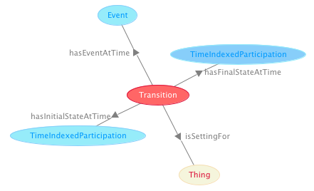

 __This pattern has been certified.__
Related submission, with evaluation history, can be found __here__

#  Graphical representation

__Diagram__

#  General description

  

#  Elements

_The __Transition__ Content OP locally defines the following ontology elements:_

 __hasEventAtTime__ (owl:ObjectProperty) The time of the event causing the transition. 
  _[hasEventAtTime](../Submissions/Transition/hasEventAtTime.md "Submissions:Transition/hasEventAtTime") page_
 __hasFinalStateAtTime__ (owl:ObjectProperty) The time of the final state of the transition. 
  _[hasFinalStateAtTime](../Submissions/Transition/hasFinalStateAtTime.md "Submissions:Transition/hasFinalStateAtTime") page_
 __hasInitialStateAtTime__ (owl:ObjectProperty) The time of the initial state in the transition. 
  _[hasInitialStateAtTime](../Submissions/Transition/hasInitialStateAtTime.md "Submissions:Transition/hasInitialStateAtTime") page_
 __includesFinalSituation__ (owl:ObjectProperty) A relation between a transition situation and the situation resulting from the transition. 
  _[includesFinalSituation](../Submissions/Transition/includesFinalSituation.md "Submissions:Transition/includesFinalSituation") page_
 __includesInitialSituation__ (owl:ObjectProperty) A relation between a transition situation and the situation existing before the transition event. 
  _[includesInitialSituation](../Submissions/Transition/includesInitialSituation.md "Submissions:Transition/includesInitialSituation") page_
 __includesProcess__ (owl:ObjectProperty) A relation between a transition situation and the underlying process that is invariant for the object(s) included in the transition. 
  _[includesProcess](../Submissions/Transition/includesProcess.md "Submissions:Transition/includesProcess") page_
 __isFinalSituationIncludedIn__ (owl:ObjectProperty) A relation between a transition situation and the situation resulting from the transition. 
  _[isFinalSituationIncludedIn](../Submissions/Transition/isFinalSituationIncludedIn.md "Submissions:Transition/isFinalSituationIncludedIn") page_
 __isInitialSituationIncludedIn__ (owl:ObjectProperty) A relation between a transition situation and the situation existing before the transition event. 
  _[isInitialSituationIncludedIn](../Submissions/Transition/isInitialSituationIncludedIn.md "Submissions:Transition/isInitialSituationIncludedIn") page_
 __isProcessIncludedIn__ (owl:ObjectProperty) A relation between a transition situation and the underlying process that is invariant for the object(s) included in the transition. 
  _[isProcessIncludedIn](../Submissions/Transition/isProcessIncludedIn.md "Submissions:Transition/isProcessIncludedIn") page_
 __isTimeOf__ (owl:ObjectProperty) 
  _[isTimeOf](../Submissions/Transition/isTimeOf.md "Submissions:Transition/isTimeOf") page_
 __occursAt__ (owl:ObjectProperty) 
  _[occursAt](../Submissions/Transition/occursAt.md "Submissions:Transition/occursAt") page_
 __Process__ (owl:Class) The invariance under some different transitions (including the one represented here), in which at least one Object is situated. 
  _[Process](../Submissions/Transition/Process.md "Submissions:Transition/Process") page_
 __Transition__ (owl:Class) In this pattern, it is the entity that is invariant across the Process underlying the transition, but is also changed from an initial to a final state by an Event.
  

A transition is a Situation that creates a context for three TimeInterval(s), two additional different Situation(s), one Event, one Process, and at least one Object: the Event is observed as the cause for the transition, one Situation is the state before the transition, the second Situation is the state after the transition, the Process is the invariance under some different transitions (including the one represented here), in which at least one Object is situated. Finally, the time intervals position the situations and the transitional event in time.

This class of situations partly encodes the ontology underlying typical engineering algebras for processes, e.g. Petri Nets. 

A full representation of the transition ontology is outside the expressivity of OWL, because we would need qualified cardinality restrictions, coreference, property equivalence, and property composition. 

  _[Transition](../Submissions/Transition/Transition.md "Submissions:Transition/Transition") page_
#  Additional information

A simple pattern to represent transitions between states.

#  Scenarios

__Scenarios about Transition__
No scenario is added to this Content OP.

#  Reviews

__Reviews about Transition__
There is no review about this proposal.
This revision (revision ID __9137__) takes in account the reviews: none

Other info at [evaluation tab](http://ontologydesignpatterns.org/wiki/index.php?title=Submissions:Transition&action=evaluation "http://ontologydesignpatterns.org/wiki/index.php?title=Submissions:Transition&action=evaluation")

  

#  Modeling issues

__Modeling issues about Transition__
There is no Modeling issue related to this proposal.

  

#  References

[Add a reference](index.php@title=Odp%253AAdd_reference&subject=../Submissions/Transition.md "http://ontologydesignpatterns.org/wiki/index.php?title=Odp:Add_reference&subject=Submissions%3ATransition")

  

Retrieved from "[http://ontologydesignpatterns.org/wiki/Submissions:Transition](../Submissions/Transition.md)"
 [Category](http://ontologydesignpatterns.org/wiki/Special:Categories "Special:Categories"): [ProposedContentOP](../Category/ProposedContentOP.md "Category:ProposedContentOP")