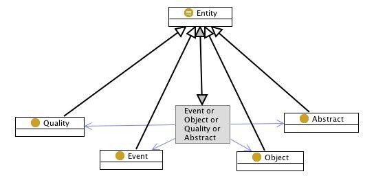
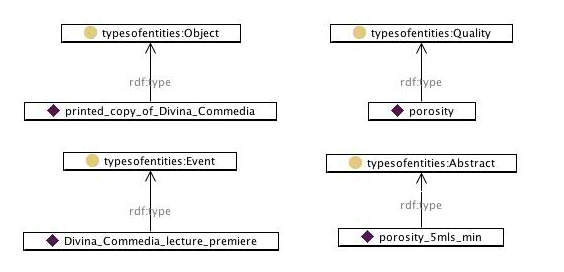

 __This pattern has been certified.__
Related submission, with evaluation history, can be found __here__

#  Graphical representation

__Diagram__

#  General description

  

#  Elements

_The __Types of entities__ Content OP locally defines the following ontology elements:_

 __Abstract__ (owl:Class) any entity that cannot be located in space-time. E.g. mathematical entities, formal semantics
elements, regions within dimensional spaces, etc. 

  _[Abstract](../Submissions/Types_of_entities/Abstract "Submissions:Types of entities/Abstract") page_

 __Event__ (owl:Class) any physical, social, or mental process, event, or state. More theoretically, events can be
classified in different ways, possibly based on aspect (e.g. stative, continuous, achievements, etc.), or
on agentivity, typical participants (e.g. human, physical, abstract, food, etc.). 

  _[Event](../Submissions/Types_of_entities/Event "Submissions:Types of entities/Event") page_

 __Object__ (owl:Class) any physical, social, or mental object, or a substance. 

  _[Object](../Submissions/Types_of_entities/Object "Submissions:Types of entities/Object") page_

 __Quality__ (owl:Class) any aspect of an entity (but not a part of it), which cannot exist without that entity. For
example, the way the surface of a specific physical object looks like is a Quality. 

  _[Quality](../Submissions/Types_of_entities/Quality "Submissions:Types of entities/Quality") page_
#  Additional information

###  Example

That copy of Divina Commedia is a book (Object), the porosity (Quality) of the paper used is 5 mls/min (Abstract). 
The Rock Music Festival (Event) is organized by a friend of mine (Object). 

Figure shows the UML diagram of this scenario.

  

#  Scenarios

__Scenarios about Types of entities__
No scenario is added to this Content OP.

#  Reviews

__Reviews about Types of entities__
There is no review about this proposal.
This revision (revision ID __9139__) takes in account the reviews: none

Other info at [evaluation tab](http://ontologydesignpatterns.org/wiki/index.php?title=Submissions:Types_of_entities&action=evaluation "http://ontologydesignpatterns.org/wiki/index.php?title=Submissions:Types_of_entities&action=evaluation")

  

#  Modeling issues

__Modeling issues about Types of entities__
There is no Modeling issue related to this proposal.

  

#  References

[Add a reference](index.php@title=Odp%253AAdd_reference&subject=Submissions%253ATypes+of+entities.html "http://ontologydesignpatterns.org/wiki/index.php?title=Odp:Add_reference&subject=Submissions%3ATypes+of+entities")

  

Retrieved from "[http://ontologydesignpatterns.org/wiki/Submissions:Types\_of\_entities](../Submissions/Types_of_entities)"
 [Category](http://ontologydesignpatterns.org/wiki/Special:Categories "Special:Categories"): [ProposedContentOP](../Category/ProposedContentOP "Category:ProposedContentOP")