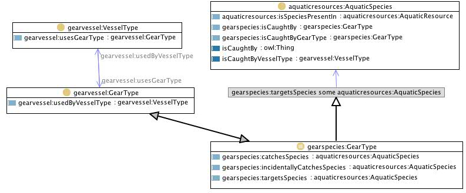

 __This pattern has been certified.__
Related submission, with evaluation history, can be found __here__

#  Graphical representation

__Diagram__

#  General description

  

#  Elements

_The __VesselSpecies__ Content OP locally defines the following ontology elements:_

 __isCaughtBy__ (owl:ObjectProperty) Actually a composed property: this needs either a property chain, a SPARQL query, or a SWRL rule to gather a value. E.g. in SPARQL:
  

CONSTRUCT {?x :catchesSpecies ?y . ?y isCaughtBy ?x}

WHERE {

?x gearvessel:usesGearType ?z .

?z gearspecies:catchesSpecies ?y

} 

  _[isCaughtBy](../Submissions/VesselSpecies/isCaughtBy "Submissions:VesselSpecies/isCaughtBy") page_
 __catchesSpecies__ (owl:ObjectProperty) Actually a composed property: this needs either a property chain, a SPARQL query, or a SWRL rule to gather a value. E.g. in SPARQL:
  

CONSTRUCT {?x :catchesSpecies ?y . ?y isCaughtBy ?x}

WHERE {

?x gearvessel:usesGearType ?z .

?z gearspecies:catchesSpecies ?y

} 

  _[catchesSpecies](../Submissions/VesselSpecies/catchesSpecies "Submissions:VesselSpecies/catchesSpecies") page_
 __isCaughtByVesselType__ (owl:ObjectProperty) 
  _[isCaughtByVesselType](../Submissions/VesselSpecies/isCaughtByVesselType "Submissions:VesselSpecies/isCaughtByVesselType") page_
#  Additional information

This pattern composes gearvessel.owl and gearspecies.owl.
This must be inferred compositionally, and requires either more sophisticated logical pattern, like 'property chain', available in OWL2 (but not in OWL1), or a complex reasoning pattern, like 'DL classifier+SPARQL', or 'DL classifier+SWRL rule firing'.

(type): [http://www.w3.org/2002/07/owl#Ontology](http://www.w3.org/2002/07/owl#Ontology "http://www.w3.org/2002/07/owl#Ontology")

(versionInfo): Created by Alessandro Adamou

(comment): This pattern composes gearvessel.owl and gearspecies.owl.
This must be inferred compositionally, and requires either more sophisticated logical pattern, like 'property chain', available in OWL2 (but not in OWL1), or a complex reasoning pattern, like 'DL classifier+SPARQL', or 'DL classifier+SWRL rule firing'.

(relatedCPs): [http://www.ontologydesignpatterns.org/cp/owl/fsdas/gearspecies.owl](http://www.ontologydesignpatterns.org/cp/owl/fsdas/gearspecies.owl "http://www.ontologydesignpatterns.org/cp/owl/fsdas/gearspecies.owl")

(hasComponent): <[http://www.ontologydesignpatterns.org/cp/owl/fsdas/gearspecies.owl](http://www.ontologydesignpatterns.org/cp/owl/fsdas/gearspecies.owl "http://www.ontologydesignpatterns.org/cp/owl/fsdas/gearspecies.owl")>

(imports): [http://www.ontologydesignpatterns.org/schemas/cpannotationschema.owl](http://www.ontologydesignpatterns.org/schemas/cpannotationschema.owl "http://www.ontologydesignpatterns.org/schemas/cpannotationschema.owl")

(imports): [http://www.ontologydesignpatterns.org/cp/owl/fsdas/gearspecies.owl](http://www.ontologydesignpatterns.org/cp/owl/fsdas/gearspecies.owl "http://www.ontologydesignpatterns.org/cp/owl/fsdas/gearspecies.owl")

(hasComponent): <[http://www.ontologydesignpatterns.org/cp/owl/fsdas/gearvessel.owl](http://www.ontologydesignpatterns.org/cp/owl/fsdas/gearvessel.owl "http://www.ontologydesignpatterns.org/cp/owl/fsdas/gearvessel.owl")>

(imports): [http://www.ontologydesignpatterns.org/cp/owl/fsdas/gearvessel.owl](http://www.ontologydesignpatterns.org/cp/owl/fsdas/gearvessel.owl "http://www.ontologydesignpatterns.org/cp/owl/fsdas/gearvessel.owl")

(versionInfo): 1.1

#  Scenarios

__Scenarios about VesselSpecies__
No scenario is added to this Content OP.

#  Reviews

__Reviews about VesselSpecies__
This revision (revision ID __9141__) takes in account the reviews: [AldoGangemi about VesselSpecies](../Reviews/AldoGangemi_about_VesselSpecies "Reviews:AldoGangemi about VesselSpecies")

Other info at [evaluation tab](http://ontologydesignpatterns.org/wiki/index.php?title=Submissions:VesselSpecies&action=evaluation "http://ontologydesignpatterns.org/wiki/index.php?title=Submissions:VesselSpecies&action=evaluation")

  

#  Modeling issues

__Modeling issues about VesselSpecies__
There is no Modeling issue related to this proposal.

  

#  References

[Add a reference](index.php@title=Odp%253AAdd_reference&subject=../Submissions/VesselSpecies "http://ontologydesignpatterns.org/wiki/index.php?title=Odp:Add_reference&subject=Submissions%3AVesselSpecies")

  

Retrieved from "[http://ontologydesignpatterns.org/wiki/Submissions:VesselSpecies](../Submissions/VesselSpecies)"
 [Category](http://ontologydesignpatterns.org/wiki/Special:Categories "Special:Categories"): [ProposedContentOP](../Category/ProposedContentOP "Category:ProposedContentOP")