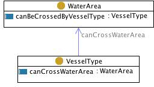

 __This pattern has been certified.__
Related submission, with evaluation history, can be found __here__

#  General description

  

#  Elements

_The __VesselWaterArea__ Content OP locally defines the following ontology elements:_

 __VesselType__ (owl:Class) Vessel types are conceptual entities. 
Mappable to fi:VesseltypeRef 

  _[VesselType](../Submissions/VesselWaterArea/VesselType "Submissions:VesselWaterArea/VesselType") page_
 __WaterArea__ (owl:Class) A physical water area. Mappable to fi:WaterAreaRef 
  _[WaterArea](../Submissions/VesselWaterArea/WaterArea "Submissions:VesselWaterArea/WaterArea") page_
 __canCrossWaterArea__ (owl:ObjectProperty) 
  _[canCrossWaterArea](../Submissions/VesselWaterArea/canCrossWaterArea "Submissions:VesselWaterArea/canCrossWaterArea") page_
 __canBeCrossedByVesselType__ (owl:ObjectProperty) A physical water area. Mappable to fi:WaterAreaRef 
  _[canBeCrossedByVesselType](../Submissions/VesselWaterArea/canBeCrossedByVesselType "Submissions:VesselWaterArea/canBeCrossedByVesselType") page_
(type): [http://www.w3.org/2002/07/owl#Ontology](http://www.w3.org/2002/07/owl#Ontology "http://www.w3.org/2002/07/owl#Ontology")

(versionInfo): 1.1

(imports): [http://www.ontologydesignpatterns.org/schemas/cpannotationschema.owl](http://www.ontologydesignpatterns.org/schemas/cpannotationschema.owl "http://www.ontologydesignpatterns.org/schemas/cpannotationschema.owl")

(versionInfo): Created by Alessandro Adamou

#  Scenarios

__Scenarios about VesselWaterArea__
No scenario is added to this Content OP.

#  Reviews

__Reviews about VesselWaterArea__
This revision (revision ID __3687__) takes in account the reviews: none

Other info at [evaluation tab](http://ontologydesignpatterns.org/wiki/index.php?title=Submissions:VesselWaterArea&action=evaluation "http://ontologydesignpatterns.org/wiki/index.php?title=Submissions:VesselWaterArea&action=evaluation")

Retrieved from "[http://ontologydesignpatterns.org/wiki/Submissions:VesselWaterArea](../Submissions/VesselWaterArea)"
 [Category](http://ontologydesignpatterns.org/wiki/Special:Categories "Special:Categories"): [ProposedContentOP](../Category/ProposedContentOP "Category:ProposedContentOP")