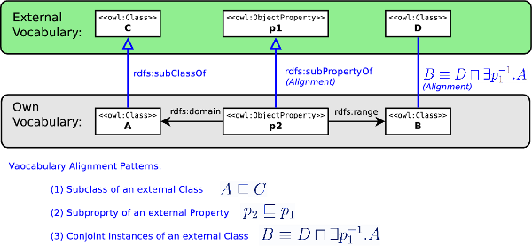

[](../../Image/Certified.png.md "Certified.png") __This pattern has been certified.__
Related submission, with evaluation history, can be found __here__


#  Graphical representation


__Diagram__


[](../../Image/Alignment-odp.png.md "Image:Alignment-odp.png")


#  General information


  


#  Description


  


```

 B owl:equivalentClass [ a owl:Class ; 
        owl:intersectionOf ( D
		[   a owl:Restriction ;
		    owl:onProperty [ owl:inverseOf p1 ]; 
		    owl:someValuesFrom A
		]
	)
     ].

 ].
 

```

  


#  Example


  


#  Reference


  


#  Scenarios


__Scenarios about Vocabulary Alignment Pattern: Conjoint Instances of an external Class__
No scenario is added to this Content OP.


#  Reviews


__Reviews about Vocabulary Alignment Pattern: Conjoint Instances of an external Class__
There is no review about this proposal.
This revision (revision ID __10915__) takes in account the reviews: none


Other info at [evaluation tab](http://ontologydesignpatterns.org/wiki/index.php?title=Submissions:Vocabulary_Alignment_Pattern:_Conjoint_Instances_of_an_external_Class&action=evaluation "http://ontologydesignpatterns.org/wiki/index.php?title=Submissions:Vocabulary_Alignment_Pattern:_Conjoint_Instances_of_an_external_Class&action=evaluation")


  


#  Modeling issues


__Modeling issues about Vocabulary Alignment Pattern: Conjoint Instances of an external Class__
There is no Modeling issue related to this proposal.


  


#  References


[Add a reference](index.php@title=Odp%253AAdd_reference&subject=Submissions%253AVocabulary+Alignment+Pattern%253A+Conjoint+Instances+of+an+external+Class.html "http://ontologydesignpatterns.org/wiki/index.php?title=Odp:Add_reference&subject=Submissions%3AVocabulary+Alignment+Pattern%3A+Conjoint+Instances+of+an+external+Class")


  


Retrieved from "[http://ontologydesignpatterns.org/wiki/Submissions:Vocabulary\_Alignment\_Pattern:\_Conjoint\_Instances\_of\_an\_external\_Class](../../Submissions/Vocabulary_Alignment_Pattern/_Conjoint_Instances_of_an_external_Class.md)"
 [Categories](http://ontologydesignpatterns.org/wiki/Special:Categories "Special:Categories"): [ProposedAlignmentOP](../../Category/ProposedAlignmentOP.md "Category:ProposedAlignmentOP") | [AlignmentOP](../../Category/AlignmentOP.md "Category:AlignmentOP")