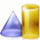

___po-place__ has [Category:OntologyElement](../../Category/OntologyElement "Category:OntologyElement") and is an [element of](../../Property/ElementOf "Property:ElementOf") [WinstonPartWhole](../../Submissions/WinstonPartWhole "Submissions:WinstonPartWhole")_

  

__Name__: po-place 

__Type:__ owl:ObjectProperty 

__Description__: 

Retrieved from "[http://ontologydesignpatterns.org/wiki/Submissions:WinstonPartWhole/po-place](../../Submissions/WinstonPartWhole/po-place)"
 [Category](http://ontologydesignpatterns.org/wiki/Special:Categories "Special:Categories"): [OntologyElement](../../Category/OntologyElement "Category:OntologyElement")