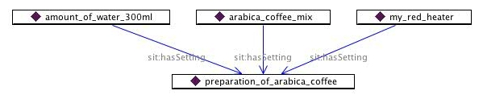

This is a template for printing CP Examples.


```

{Example
|Image=
|Text=
}

```

  


####  Example of usage


```

{Example
|Image=SituationExampleDiagram.jpg
|Text=Content of the Text field
}

```

The result is


Content of the Text field


[](../Image/SituationExampleDiagram.jpg.md "Image:SituationExampleDiagram.jpg")


  


Retrieved from "[http://ontologydesignpatterns.org/wiki/Template:Example](../Template/Example.md)"