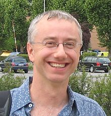

#   Data Archeology for Ontology Patterns

__by  [Chris Welty](../../User/ChrisWelty "User:ChrisWelty")__  

__IBM Research__

###   Abstract

Ontology Patterns for the semantic web are closest in spirit to software patterns, e.g. [Gamma, et al, 1997]. They are, or should be, motivated by design experience, not philosophical tradition. The software pattern community was launched into prominence as the result of an effort in "software archeology": digging through existing software, observing and cataloging different solution methods, generalizing and classifying them in a sensible framework, and publishing the result. In this talk I will argue for an archeological and less theoretical approach to ontology patterns, with examples.

###   Short Bio

Chris Welty is a Research Scientist at the IBM T.J. Watson Research Center in New York. His principal area of research is Knowledge Representation, specifically ontologies and the semantic web, and he spends most of his time applying this technology to Natural Language Question Answering as a member of the DeepQA/Watson team. He is best known as a co-developer of the OntoClean methodology with Nicola Guarino, and as the co-chair of the W3C RIF working group.

Retrieved from "[http://ontologydesignpatterns.org/wiki/WOP:2010/KeynoteTalk](../../WOP/2010/KeynoteTalk)"