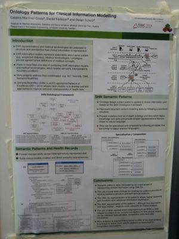

##   Welcome to the Workshop on Ontology and Semantic Web Patterns (5th edition) - WOP2014


This is the fifth edition in a series of workshops addressing the topic of __ontology and semantic web patterns as best practices__, related to the [_ontologydesignpatterns.org_](../Ontology_Design_Patterns_._org_(ODP).md).html "Ontology Design Patterns . org (ODP)") initiative. 


This edition of WOP will be the very first in Europe, in which traditionally the design pattern community for semantic web and linked data has been very strong. As interest in the Semantic Web increases and technologies for realizing the Semantic Web become more mature, the need for high-quality and reusable Semantic Web ontologies increases as well. To address the quality and reusability issues, different types of Ontology Design Patterns (ODPs) have emerged, and methods for devising or discovering new ones from heterogeneous knowledge sources are needed.


Patterns need to be shared by a community in order to provide a common language, and to stimulate pattern usage and development. Hence, the aim of this workshop is twofold 


* providing an arena for proposing and discussing good practices, patterns, pattern-based ontologies, systems etc., and
* broadening the pattern community that is developing its own “language” for discussing and describing relevant problems and their solutions.


For more background on the workshop series, see the  [main page](../WOP/Main.md "WOP:Main").


WOP2014 will be a _full-day workshop_ consisting of two parts: paper presentations and posters. The poster session will feature pattern posters, i.e. presentations of patterns submitted according the  [call for patterns](../WOP/2014.md#Call_for_Patterns "WOP:2014"). 


  


##   Venue and dates


__(update 19-8-2014)__ The fifth edition of WOP is [confirmed to be held as a full-day workshop](http://iswc2014.semanticweb.org/node/68 "http://iswc2014.semanticweb.org/node/68") on __October 19 2014__, in conjunction with [ISWC 2014](http://www.iswc2014.semanticweb.org/ "http://www.iswc2014.semanticweb.org/")


###   Social Dinner


For the WOP2014 social dinner, we are gathering in front of the main entrance of the conference venue at 20.00. Please be on time so we don't leave you behind. In case you lose us call Victor: 0031647418031


##   Program


####  Keynote speaker


WOP2014 will feature a keynote speech from [Valentina Presutti](http://stlab.istc.cnr.it/stlab/User:ValentinaPresutti "http://stlab.istc.cnr.it/stlab/User:ValentinaPresutti"). Valentina Presutti is a researcher at the Semantic Technology Laboratory of the National Research Council (CNR) in Rome, and she is associated at LIPN (University Paris 13 and CNRS) [View slides on slideshare](http://www.slideshare.net/vpresutti/fueling-the-future-with-semantic-web-patterns-keynote-at-wop2014iswc "http://www.slideshare.net/vpresutti/fueling-the-future-with-semantic-web-patterns-keynote-at-wop2014iswc")


* _Title_: Fueling the future with Semantic Web Patterns
* _Abstract_: I will claim that Semantic Web Patterns can drive the next technological breakthrough: they can be key for providing intelligent applications with sophisticated ways of interpreting data. I will picture scenarios of a possible not so far future in order to support my claim. I will argue that current Semantic Web Patterns are not sufficient for addressing the envisioned requirements, and I will suggest a research direction for fixing the problem, which includes the hybridization of existing computer science pattern-based approaches, and human computing.
* [](../Image/150px-ValDec2011.jpg.md "caption")_Bio_: Valentina Presutti, Ph.D is a researcher at the Semantic Technology Laboratory, at the Institute of Cognitive Sciences and Technologies of the National Research Council, in Italy. Her research work focuses on diverse projects involving semantic technologies for machine reading, knowledge extraction, and cognitive computing. She was a project leader of the EU project “Interactive Knowledge Stack” and one of the main researchers of the EU project NeOn, during which she developed a catalogue of ontology design patterns and started the ontologydesignpatterns.org initiative. She is author of more than 60 publications in international scientific conferences and journals related to Semantic Web technologies. She was co-chair of WOP in 2010 and she is actively involved in the Semantic Web community as program chair of the iSemantics conference and the European Semantic Web Conference in 2012 and 2013, and as General Chair of ESWC in 2014. Her homepage is at [http://stlab.istc.cnr.it/stlab/User:ValentinaPresutti](http://stlab.istc.cnr.it/stlab/User:ValentinaPresutti| "http://stlab.istc.cnr.it/stlab/User:ValentinaPresutti|")


####  Accepted papers


Note that these are only preprints of the papers, the final version of the proceedings will be published by CEUR Workshop proceedings. Please refer to the proceedings, rather than this website, when citing the papers. The two papers with an asterix (\*) have been invited to the SWJ fast-track (see below).


Full research papers:


* __[A pattern-based ontology for describing publishing workflows](../../images/2/2e/Paper_5.pdf "Paper 5.pdf")__\* By: Aldo Gangemi, Silvio Peroni, David Shotton and Fabio Vitali
* __[Building ontologies from textual resources: A pattern based improvement using deep linguistic information](../../images/a/a9/Paper_7.pdf "Paper 7.pdf")__ By: Sami Ghadfi, Nicolas Béchet and Giuseppe Berio
* __[Towards the reuse of standardized thesauri into ontologies](../images/3/37/Paper_8_update.pdf "Paper 8 update.pdf")__ By: Elena Cardillo, Antonietta Folino, Roberto Trunfio and Roberto Guarasci (note: this is an updated version of this paper)
* __[Digging Ontology Correspondence Antipatterns](../../images/a/ac/Paper_12.pdf "Paper 12.pdf")__ By: Anselmo Guedes, Fernanda Araujo Baiao and Kate Revoredo


Full research papers containing pattern description:


* __[An Ontology Design Pattern for Cooking Recipes - Classroom Created](../../images/0/01/Paper_4.pdf "Paper 4.pdf")__ By: Monica Sam, Adila A. Krisnadhi, Cong Wang, John Gallagher and Pascal Hitzler
* __[Ontology Patterns for Clinical Information Modelling](../../images/2/23/Paper_6.pdf "Paper 6.pdf")__ By: Catalina Martínez-Costa, Daniel Karlsson and Stefan Schulz


Patterns:


* __[Material Transformation](../Submissions/Material_Transformation.md "Submissions:Material Transformation")__ ( __[An Ontology Design Pattern for Material Transformation](../../images/0/0b/Paper_13.pdf "Paper 13.pdf")__)\* Submitted by: Charles Vardeman, Adila A. Krisnadhi, Michelle Cheatham, Krzysztof Janowicz, Holly Ferguson, Pascal Hitzler, Aimee Buccellato, Krishnaprasad Thirunarayan, Gary Berg-Cross and Torsten Hahmann
* __[An Ontology Design Pattern for Activity Reasoning](../../images/9/98/Paper_14.pdf "Paper 14.pdf")__ Submitted by: Amin Abdalla, Yingjie Hu, David Carral, Naicong Li and Krzysztof Janowicz


####  Workshop schedule


(last updated 19-10)


* __09:00-09:10__ Opening and welcome
* __09:10-10:00__ Keynote Valentina Presutti: Fueling the future with Semantic Web Patterns
* __10:00-10:30__ Paper presentation:  __[An Ontology Design Pattern for Cooking Recipes - Classroom Created](../../images/0/01/Paper_4.pdf "Paper 4.pdf")__ Monica Sam, Adila A. Krisnadhi, Cong Wang, John Gallagher and Pascal Hitzler
* __10:30-11:00__ Coffee and posters
* __11:00-11:30__ Paper presentation: __[Ontology Patterns for Clinical Information Modelling](../../images/2/23/Paper_6.pdf "Paper 6.pdf")__Catalina Martínez-Costa, Daniel Karlsson and Stefan Schulz
* __11:30-12:00__ Paper presentation: __[Digging Ontology Correspondence Antipatterns](../../images/a/ac/Paper_12.pdf "Paper 12.pdf")__ Anselmo Guedes, Fernanda Araujo Baiao and Kate Revoredo
* __12:00-12:30__ Paper presentation: __[Towards the reuse of standardized thesauri into ontologies](../images/0/03/Paper_8.pdf "Paper 8.pdf")__ Elena Cardillo, Antonietta Folino, Roberto Trunfio and Roberto Guarasci
* __12:30-14:00__ Lunch
* __14:00-14:15__ Pattern presentation: __[An Ontology Design Pattern for Material Transformation](../../images/0/0b/Paper_13.pdf "Paper 13.pdf")__ : Charles Vardeman, Adila A. Krisnadhi, Michelle Cheatham, Krzysztof Janowicz, Holly Ferguson, Pascal Hitzler, Aimee Buccellato, Krishnaprasad Thirunarayan, Gary Berg-Cross and Torsten Hahmann
* __14:15-14:30__ Pattern presentation: __[An Ontology Design Pattern for Activity Reasoning](../../images/9/98/Paper_14.pdf "Paper 14.pdf")__ Amin Abdalla, Yingjie Hu, David Carral, Naicong Li and Krzysztof Janowicz
* __14:30-15:00__ Paper presentation: __[A pattern-based ontology for describing publishing workflows](../../images/2/2e/Paper_5.pdf "Paper 5.pdf")__ Aldo Gangemi, Silvio Peroni, David Shotton and Fabio Vitali
* __15:00-15:30__ Paper presentation: __[Building ontologies from textual resources: A pattern based improvement using deep linguistic information](../../images/a/a9/Paper_7.pdf "Paper 7.pdf")__ Sami Ghadfi, Nicolas Béchet and Giuseppe Berio
* __15:30-16:00__ Coffee and posters
* __16:00-17:00__ Discussion, closing and best poster award


##   Call for Papers - Topics


Submission instruction for research papers (including position papers) can be found at the  [submission page](../WOP/2014/Submission.md "WOP:2014/Submission").


The main aim of the workshop is to discuss and collect solutions to recurrent problems that matter to researchers and practitioners of the Semantic Web field, and that impact on design and engineering of ontologies, linked data, knowledge extraction, and other semantic web applications. We invite the submission of original research results related to the focus areas of the workshop. _Research papers_ (maximum 12 pages LNCS style) should present mature work and document established results, or be _short papers_ presenting proposed research directions and novel ideas (maximum 4 pages LNCS style). Original research papers and short papers are invited to consider the following (non exhaustive) list of topics:


* Ontology design patterns (ODPs) and pattern-based ontology design
* Anti-patterns and their relations to ODPs
* Pattern-based ontologies
* Ontology patterns and their relation with standards
* Ontology pattern extraction
* Analysis of ontology pattern usage
* Pattern-based ontology evaluation and selection
* Correspondence patterns for ontology matching and integration
* Best practices and examples for using existing ontologies/datasets to instantiate ODPs
* Discussion of use cases of particular ODPs across ontologies
* Evaluation of ODPs (methods, benchmarks)


  


* Patterns and Linked data (usage, emerging patterns, etc.)
* Linked Data patterns, patterns for using different vocabularies together
* Web semantics from a pattern perspective
* ODPs used for interaction with data
* Data mining patterns
* Automatic ontology construction (ontology learning) based on patterns
* Reasoning pipelines
* Usage of patterns in business intelligence


  


* Relation between NLP patterns (either for learning, or procedural) and ontologies/linked data design
* Frame semantics in text and knowledge representation
* Knowledge patterns and knowledge reengineering based on patterns
* Pattern-based information extraction
* Nary-fact extraction and representation


  


* Patterns in semantic social networks, semantic wikis, semantic blogs
* Reengineering patterns for conceptual models, folksonomies, lexicons, thesauri
* Usage of patterns in conceptual modeling
* Processes and services process patterns
* Problem solving methods and patterns
* Contextual reasoning and patterns as context


  


* Pattern-based methods and methodologies for development of semantic applications
* Usage of patterns in Semantic Web design
* Collaborative ontology design and collaboration patterns
* Tools and applications for pattern-based knowledge engineering


  


* Ontology Patterns for specific domains (cultural heritage, digital humanities, multimedia, etc).


##   Call for Patterns


We invite the submission of research results in the form of ontology design patterns (ODPs). 
Patterns submitted should have a general relevance to the ontology engineering field, or specific interest within a knowledge domain. Patterns should solve some particular modeling problem, and be of significant interest for discussion at the workshop. Patterns should be original, in the sense that they are the intellectual product of the author(s), however they may still be based on the collective experience of a community.


Pattern submissions for the pattern session will be collected:


* through the [ODP portal](../Submissions/SubmitAPattern.md "http://ontologydesignpatterns.org/wiki/Submissions:SubmitAPattern") and
* by submitting a description of the pattern (pattern description) via [EasyChair]


Detailed instructions for patterns submission, including how to submit via the ontologydesignpatterns.org portal, are found at the  [submission page](../WOP/2014/Submission.md "WOP:2014/Submission"). Note that an account in the ODP portal is needed for submitting patterns; thus, authors should take care to request an account at least one week before their intended submission.


Pattern submissions can be made in any type of ODPs. Currently, portal templates for submission are provided for the following types of patterns (see general [typology](../OPTypes.md "OPTypes") for explanation of the types):


* Content patterns
* Structural patterns: logical and architecture patterns.
* Correspondence patterns: re-engineering and alignment patterns.


For other types of patterns, the author is welcome to submit only a pattern description.


  


##   Submission and Important Dates


For details on how to submit to WOP2014 see the  [submission page](../WOP/2014/Submission.md "WOP:2014/Submission"). 


__Important dates__


* Submission date (research papers and patterns): __16 July, 2014__  __(UPDATED DEADLINE)__
* Author notifications: __August 11, 2014__
* Camera-ready proceedings: __August 25, 2014__
* Workshops will be held on __October 19, 2014__


###   Fast-track submission to the Semantic Web journal


This year's workshop on ontology and semantic web patterns will offer a fast-track submission of selected papers to the [Semantic Web](http://semantic-web-journal.net "http://semantic-web-journal.net") journal's [special issue on ontology design patterns](http://www.semantic-web-journal.net/blog/special-call-ontology-design-pattern-descriptions "http://www.semantic-web-journal.net/blog/special-call-ontology-design-pattern-descriptions"). Authors of the best papers will be invited to submit a revised and extended version of their work to the journal. While fast-tracked papers will still undergo a full open and transparent review, they will be considered as _acceptable_ by the journal. Please note that we will make the selection of papers based on how suitable they are for such an extended submission and that such papers may still get rejected by the journal, e.g., if the authors fail to address the issues pointed out during review. Please contact Krzysztof if you have further questions, e.g., on the suitability of a paper.


__Results__


Based on the reviewer scores, the organization committee has decided to invite two papers (designated with an asterix in the list of accepted papers above) to this fast-track. To ensure objectivity, this decision was verified with members of the steering committee. The invited authors have been contacted.


###   Best Poster Award


Workshop participants will be able to vote for the best poster, final decision to be made by the chairs. The best poster award takes into account criteria such as the quality of the submission, the relevance and significance of patterns or pattern usages presented, the presentation of the poster during the "lightning talks", and the level of involvement of the author during the revision phase and poster session discussions during the workshop.


__The best poster award has been won by Ontology Patterns for Clinical Information Modelling as presented by Catalina Martínez-Costa__ We congratulate Catalina and her co-authors Daniel Karlsson and Stefan Schulz with this award. The poster is shown below.


```
[](../Image/Bestposter2014.jpg.md "Bestposter2014.jpg")

```

##  Proceedings


Accepted research papers and pattern descriptions will be published online as CEUR-Workshop Proceedings.


##   WOP Organisation


####   WOP2014 Chairs


* Chairs:
	+ Victor de Boer (contact [http://www.victordeboer.com/](http://www.victordeboer.com/ "http://www.victordeboer.com/")) VU University Amsterdam, the Netherlands
	+ Aldo Gangemi, Université Paris 13 - CNRS - Sorbonne Citè (FR), [_contact_](http://stlab.istc.cnr.it/stlab/User:AldoGangemi "http://stlab.istc.cnr.it/stlab/User:AldoGangemi")
	+ Krzysztof Janowicz (contact [http://geog.ucsb.edu/~jano/](http://geog.ucsb.edu/~jano/ "http://geog.ucsb.edu/~jano/")) University of California, Santa Barbara
	+ Agnieszka Ławrynowicz (contact [http://www.cs.put.poznan.pl/alawrynowicz/](http://www.cs.put.poznan.pl/alawrynowicz/ "http://www.cs.put.poznan.pl/alawrynowicz/")) Poznań University of Technology, Poland


####   Steering Committee


The workshop series is arranged by a fixed steering committee, appointing the chairs and adjusting the focus of the workshop on a yearly basis. 


The WOP Steering committee consists of:


* Eva Blomqvist, University of Linköping (SE)
* Aldo Gangemi, Université Paris 13 - CNRS - Sorbonne Cité (FR) and ISTC-CNR (IT)
* Natasha Noy, Google (US)
* Valentina Presutti, ISTC-CNR (IT)
* Alan Rector, University of Manchester (UK)
* Francois Scharffe, INRIA (FR)
* Steffen Staab, University of Koblenz (DE)
* Chris Welty, Google (US)


####   Program Committee


* Benjamin Adams, University of Auckland, NZ
* Alessandro Adamou, KMI Open University (UK)
* Lora Aroyo, VU (NL)
* Eva Blomqvist, Linköping University (SE)
* Victor de Boer, VU University Amsterdam (NL)
* Oscar Corcho, Universidad Politécnica de Madrid (ES)
* Enrico Daga, KMI Open University (UK)
* Aldo Gangemi, Université Paris 13 - CNRS - Sorbonne Citè (FR)
* Jose Manuel Gomez-Perez, Intelligent Software Components (iSOCO) (ES)
* Gerd Gröner, University of Koblenz (DE)
* Giancarlo Guizzardi, Federal University of Espírito Santo (BR)
* Pascal Hitzler, Wright State University (US)
* Rinke Hoekstra, Vrije Universiteit/Universiteit van Amsterdam, (NL)
* Krzysztof Janowicz, University of California, Santa Barbara (US)
* Adila Alfa Krisnadhi, Wright State University (US)
* Jose Emilio Labra Gayo, University of Oviedo, (ES)
* Agnieszka Ławrynowicz, Poznań University of Technology (PL)
* Steffen Lohmann, University of Stuttgart (DE)
* Timothy Lebo, RPI, USA
* Andrea Giovanni Nuzzolese, STLab ISTC-CNR (IT)
* Alessandro Oltramari, Carnegie Mellon, Pittsburgh (US)
* Raul Palma, Poznan Supercomputing and Networking Center (PL)
* María Poveda, Universidad Politécnica de Madrid (ES)
* Valentina Presutti, STLab ISTC-CNR (IT)
* Catherine Roussey, Irstea - Centre de Clermont-Ferrand, France
* Alan Ruttenberg, University at Buffalo, The State University of New York, Buffalo, NY, (US)
* Kurt Sandkuhl, University of Rostock (SE)
* Mari Carmen Suarez-Figueroa, Universidad Politécnica de Madrid, (ES)
* Vojtech Svatek, University of Economics, Prague (CZ)
* Boris Villazón-Terrazas, Intelligent Software Components (iSOCO) (ES)


Retrieved from "[http://ontologydesignpatterns.org/wiki/WOP:2014](../WOP/2014.md)"
 [Categories](http://ontologydesignpatterns.org/wiki/Special:Categories "Special:Categories"): [Event](../Category/Event.md "Category:Event") | [WOP](../Category/WOP.md "Category:WOP")